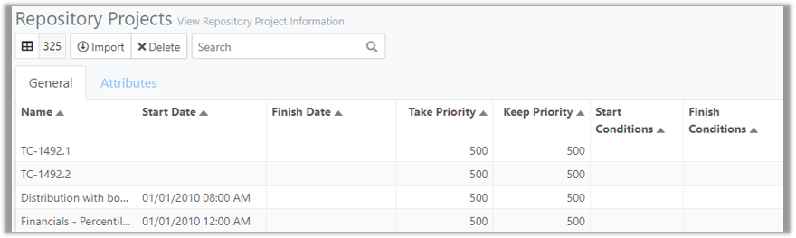

You are here: Repository 

-----

## Repository 

The Repository allows users to collect Projects for utilization in their portfolio(s). Users have the ability to add Projects to the ProModel AutoCAD Edition Repository via an Excel import. 
Multiple Tasks may be associated with a Project. The Repository allows users to duplicate or delete Project Tasks as they see fit.

### _Navigation_
**1.** After signing in, select the **Repository link** in the navigation pane on the left-hand side of the screen. 

**2.** The user is directed to the Repository page, as depicted in the image below.

**3.** This page contains two tables: Repository Projects and Repository Project Tasks. Select a **Repository Project** to view the associated Project Tasks. 

### _Terminology_
###### Projects - General Tab
- **Name**: Name of the Project.

- **Start Date**: This  is automatically set and depends upon the Project Tasks start dates. If a Project has several Tasks with different start dates, the Project start date will be the earliest of those. If none of the Tasks has a start date, the Project will not have a start date. In this case, it will start on the portfolio status date.
- **Finish Date**: Determines when the Project will end.
- **Take Priority**: The priority of the Project when resources are being taken in a constrained scenario. For example, there may be limited resources to accomplish all the work simultaneously required by multiple Projects. The Projects with the higher priority will get the resources required by their Tasks, while other Projects may need to wait for resources to become available.
- **Keep Priority**: If the Task is using a resource that another resource requires, this should be set higher than the other resource's take priority.
- **Start Conditions**: Start Conditions define any dependencies between a Project and other Projects that must be satisfied before the Project can start, as well as any time constraints that are imposed on the start of the Project. 
- **Finish Conditions**: Finish Conditions are a list of Project or time-based events that must be satisfied before the Project can finish.
- **Terminate Conditions**: Terminate Conditions are a list of Project or time-based events that, if they occur, will result in the termination (i.e., cancellation) of the Project. Terminate Conditions determine when a Project will be canceled. For example, if two Projects are running concurrently, and one fails, you might not want the other Project to continue. Terminating a Project when another Project fails can be accomplished using Terminate Conditions. For example, a Project might be terminated if any of its children tasks, projects or phases fail. Or, perhaps, if a Project is taking too long and it reaches a certain date, it may be terminated. The options available for defining a Terminate Condition are similar to that for Start Conditions.
- **Yearly Revenue**: Yearly revenue for the Project.
- **Revenue Contour**: Select from the available defined contours.
- **Fixed Cost At Start**: This item defines what the fixed cost is at the start of the Project.
- **Fixed Cost Prorated**: This item is added to the cost of the portfolio distributed evenly throughout the course of the Project to whichthe fixed cost applies.
- **Fixed Cost At End**: This item is added to the cost of the portfolio on the end date of the Project to which the fixed cost is applied.
- **FC4 - FC10**: Any additional costs the user has set up will appear in these columns of the Project table.

###### Tasks - General Tab
- **Name**: Name of the Task.

- **Outline Level**: The level describes the relative hierarchical position within the template. You may define as many levels as needed, where summary tasks (“parents”) contain “child” tasks.
- **Start Date**: The start date for the Task.
- **Finish Date**: The finish date for the Task.
- **Take Priority**: The priority of the Project when resources are being taken in a constrained scenario. For example, there may be limited resources to accomplish all the work simultaneously required by multiple Projects. The Projects with the higher priority will get the resources required by their Tasks, while other Projects may need to wait for resources to become available.
- **Keep Priority**: If the Task is using a resource that another resource requires, this should be set higher than the other resource's take priority.
- **Survival %**: Percent probability that the Task will pass or fail. During simulation, survival is determined when a Task starts and determines which duration distribution to use, passed or failed. A survival of 100% always passes and 0% always fails. A contour can be applied to survival to adjust the percent dynamically over simulated time.
- **Plan Duration**: This is a single best estimate of the time to perform the Task, so it is expressed as a constant value.
- **Override Duration**: Provides a way to define a variable Task time. For example, assume we have defined this time as a triangular distribution T(4,10,20). During simulation, for each replication, this distribution will return a value. If it returns a 6.25, and the time unit for Task times is months, the Task, will take 6.25 months for that replication.
- **Duration Completed**: The amount of time that the Task has already completed, so that the actual Task duration may be adjusted during simulation.
- **Duration Time Unit**: The unit of time the durations are specified in: hours, days, weeks, etc.
- **Resource Requirements**: List of the resources required for this Task and Project.
- **Start Conditions**: Start Conditions define any dependencies between this Task and others that must be satisfied before the Task can start, as well as any time constraints that are imposed on the start of the Task. 
- **Finish Conditions**: Finish Conditions define any dependencies between this Task and others that must be satisfied before the Task can finish, as well as any time constraints that are imposed on the completion of the Task.
- **Terminate Conditions**: Terminate Conditions are a list of Task-based or time-based events that, if they occur, will result in the termination (i.e. cancellation) of the Task.  Terminate Conditions determine when a Task will be canceled. For example, if two Tasks are running concurrently, and one fails, you might not want the other one to continue. Terminating the Task when the other fails can be defined using terminate conditions. A full list of terminate conditions and how they can be defined is given in the sub-heading “Conditions.” For example, a project might be terminated if any of its children tasks or phases fail, or perhaps if a Task is taking too long and it reaches a certain date it may be terminated. The options available for defining a Terminate Condition are similar to that for Start Conditions. The primary difference between Terminate Conditions and Start Conditions is that Terminate Conditions apply when you want the project to stop because a specific Task has started, finished, passed, failed or terminated.
- **Started Event**: Use events logic to define something that will occur at the start of an event.
- **Passed Event**: Use events logic to define something that will occur when an event passes.
- **Failed Event**: Use events logic to define something that will occur when an event fails.
- **Finished Event**: Use events logic to define something that will occur at the finish of an event.
- **Terminated Event**: Use events logic to define something that will occur at the termination of an event.
- **Yearly Revenue**: Yearly revenue for the Project.
- **Revenue Contour**: Select from the available defined contours.
- **Fixed Cost At Start**: This item defines what the fixed cost is at the start of the Project.
- **Fixed Cost Prorated**: This item is added to the cost of the portfolio distributed evenly throughout the course of the Project to which the fixed cost applies.
- **Fixed Cost At End**: This item is added to the cost of the portfolio on the end date of the Project to which the fixed cost is applied.
- **FC4 - FC10**: Any additional costs the user has set up will appear in these columns of the Tasks table.

##
Related Content:

- [Excel Import Template](C:/_git/ProModelAutodeskEdition/PorfolioSimulator.Help/wwwroot/Help/Docs/Repository/ExcelImportTemplate/ExcelImportTemplate.md)
- [Import Project](C:/_git/ProModelAutodeskEdition/PorfolioSimulator.Help/wwwroot/Help/Docs/Repository/ImportProject/ImportProject.md) 
- [Delete Project](C:/_git/ProModelAutodeskEdition/PorfolioSimulator.Help/wwwroot/Help/Docs/Repository/DeleteProject/DeleteProject.md)
- [Search Projects](C:/_git/ProModelAutodeskEdition/PorfolioSimulator.Help/wwwroot/Help/Docs/Repository/SearchProjects/SearchProjects.md) 
- [Duplicate Task](C:/_git/ProModelAutodeskEdition/PorfolioSimulator.Help/wwwroot/Help/Docs/Repository/DuplicateTask/DuplicateTask.md) 
- [Delete Task](C:/_git/ProModelAutodeskEdition/PorfolioSimulator.Help/wwwroot/Help/Docs/Repository/DeleteTask/DeleteTask.md)
- [Search Tasks](C:/_git/ProModelAutodeskEdition/PorfolioSimulator.Help/wwwroot/Help/Docs/Repository/SearchTasks/SearchTasks.md)
- [Attributes](C:/_git/ProModelAutodeskEdition/PorfolioSimulator.Help/wwwroot/Help/Docs/Repository/Attributes/Attributes.md)

##
 &copy; 2020 ProModel Corporation  705 E Timpanogos Parkway  Orem, UT 84097  Support: 888-776-6633  www.promodel.com {style ="align: left"}
