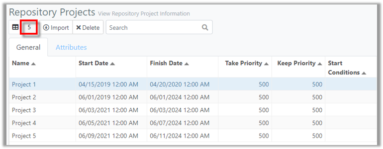
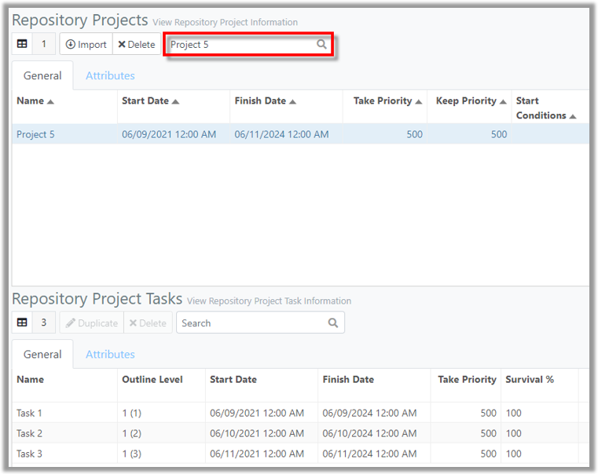
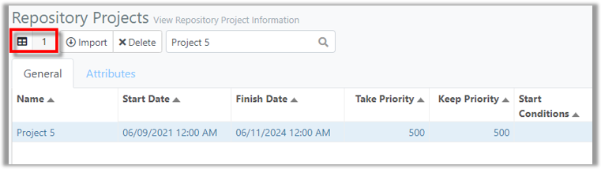

You are here: [Repository](C:/_git/ProModelAutodeskEdition/PorfolioSimulator.Help/wwwroot/Help/Docs/Repository/Repository.md) > Search Projects

---
### _Search Projects_ 

**1.** The Repository Projects **Item Count** is displayed in the top left of the toolbar. 
This number represents the total number of Repository Projects in the currently selected Division (5).

**2.** Users may search the Repository Projects table via the search bar located in the toolbar. In this example, the user intends to search by Project Name. 
Simply key in the criteria in the **search bar** located in the Repository Projects toolbar. 
Search results populate as criteria is entered. **Note: If one Project appears in the search results, the Repository Project Tasks table updates to display the Tasks associated with the Project (as the Project is selected by default).*

**3.** Note that the Item Count in the Repository Projects toolbar updates to correspond with the number of Projects displayed in the search results.

##
Related Content: 
- [Repository (overview)](C:/_git/ProModelAutodeskEdition/PorfolioSimulator.Help/wwwroot/Help/Docs/Repository/Repository.md)
- [Excel Import Template](C:/_git/ProModelAutodeskEdition/PorfolioSimulator.Help/wwwroot/Help/Docs/Repository/ExcelImportTemplate/ExcelImportTemplate.md)
- [Import Project](C:/_git/ProModelAutodeskEdition/PorfolioSimulator.Help/wwwroot/Help/Docs/Repository/ImportProject/ImportProject.md) 
- [Delete Project](C:/_git/ProModelAutodeskEdition/PorfolioSimulator.Help/wwwroot/Help/Docs/Repository/DeleteProject/DeleteProject.md) 
- [Duplicate Task](C:/_git/ProModelAutodeskEdition/PorfolioSimulator.Help/wwwroot/Help/Docs/Repository/DuplicateTask/DuplicateTask.md) 
- [Delete Task](C:/_git/ProModelAutodeskEdition/PorfolioSimulator.Help/wwwroot/Help/Docs/Repository/DeleteTask/DeleteTask.md)
- [Search Tasks](C:/_git/ProModelAutodeskEdition/PorfolioSimulator.Help/wwwroot/Help/Docs/Repository/SearchTasks/SearchTasks.md)
- [Attributes](C:/_git/ProModelAutodeskEdition/PorfolioSimulator.Help/wwwroot/Help/Docs/Repository/Attributes/Attributes.md)

##

  &copy; 2020 ProModel Corporation  705 E Timpanogos Parkway  Orem, UT 84097  Support: 888-776-6633  www.promodel.com

