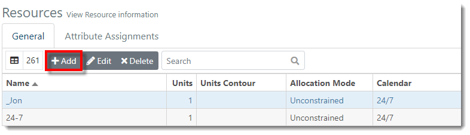
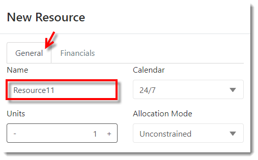
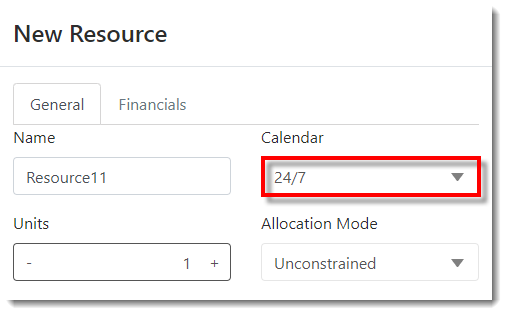
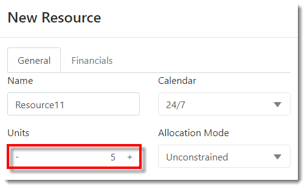
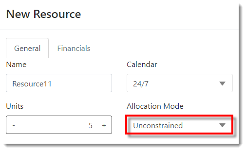
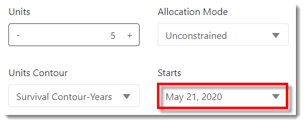
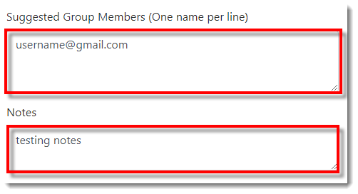
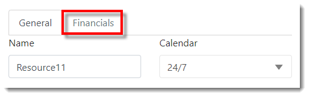
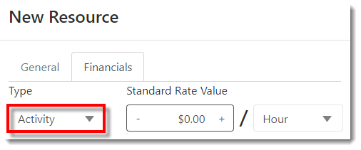
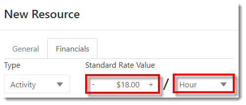



You are here: [Resources](C:/_git/ProModelAutodeskEdition/PorfolioSimulator.Help/wwwroot/Help/Docs/Resources/Resources.md) > Add Resource

----
## _**Add Resource**_ 

**1.** From the Resources page (General tab), select the **Add button** located in the Resources toolbar.

**2.** The New Resource modal populates, as depicted below. In the **General tab**, key in the **Resource Name** (must be unique).

**3.** Select the associated **Calendar** (24/7 or Standard).

**4.** Use the +/- buttons or key in the **Number of Units** (Resource availability).

**5.** Select the **Allocation Mode** (Unconstrained / Constrained / Constrained Leveling).

**6.** (*Optional*) Select the **Units Contour**, if desired (choose from all available Contours within the Division).

 

**7.** If a Units Contour was selected, specify when the contour will begin by choosing a **Start Date**.

**8.** (*Optional*) Key in the **Suggested Group Members** and any applicable **Notes**.

**9.** Select the **Financials tab** to input financial information *(alternatively, select Save if complete to close the modal)*.

**10.** In the Financials tab, select the Resource **Type** (Activity / Overhead).

**11.** Next, key in the **Standard Rate Value** and select the corresponding **time interval** (Hour / Day / Week / Month / Year). 

*  **Standard Rate / Invterval** *(dollar amount per time period selected)*
*  **Standard Rate Contour** *(optional)*
*  **Starts Date** *(if a standard rate contour has been selected, specify when the contour will begin)*
*  **Cost Per Use** *(the cost the resource will accrue whenever it is used on a task in addition to any time-based cost incurred by its “Standard Rate”)*
*  **Accrued** *(the Cost Per Use fee can be applied to the resource at the start or end of a task, or prorated over the duration of the task)*

**12.** Select **Save** at the bottom-right corner of the modal once complete.

**13.** The newly added Resource appears in the Resources table in alphabetical order, as depicted in the image below.

---

**Related Content**:
* [Resources (overview)](C:/_git/ProModelAutodeskEdition/PorfolioSimulator.Help/wwwroot/Help/Docs/Resources/Resources.md)
* [Edit Resource](C:/_git/ProModelAutodeskEdition/PorfolioSimulator.Help/wwwroot/Help/Docs/Resources/EditResource/EditResource.md)
* [Delete Resource](C:/_git/ProModelAutodeskEdition/PorfolioSimulator.Help/wwwroot/Help/Docs/Resources/DeleteResource/DeleteResource.md)
* [Search Resources](C:/_git/ProModelAutodeskEdition/PorfolioSimulator.Help/wwwroot/Help/Docs/Resources/SearchResources/SearchResources.md)
* [Attribute Assignments](C:/_git/ProModelAutodeskEdition/PorfolioSimulator.Help/wwwroot/Help/Docs/Resources/AttributeAssignments/AttributeAssignments.md)

---

  &copy; 2020 ProModel Corporation  705 E Timpanogos Parkway  Orem, UT 84097  Support: 888-776-6633  www.promodel.com {style ="align: left"}

