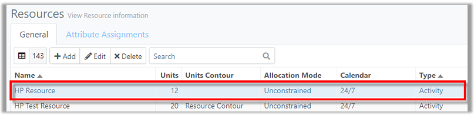
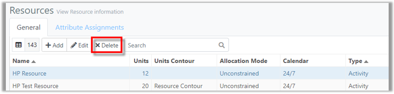
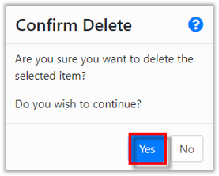
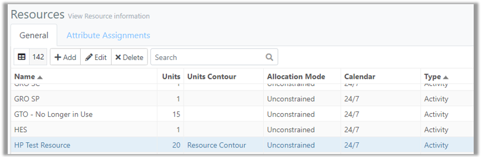



You are here: [Resources](C:/_git/ProModelAutodeskEdition/PorfolioSimulator.Help/wwwroot/Help/Docs/Resources/Resources.md) > Delete Resource

----
### _Delete Resource_ 

**1.** Select a **Resource** to be deleted from the Resources table. The selected Resource is indicated with a blue highlight.

**2.** Select the **Delete button** located in the Resources toolbar.

**3.** A 'Confirm Delete' modal populates. Select **Yes** to continue and delete the Resource.

**4.** The deleted Resource no longer appears in the Resources table.

##
Related Content:
* [Resource (overview)](C:/_git/ProModelAutodeskEdition/PorfolioSimulator.Help/wwwroot/Help/Docs/Resources/Resources.md)
* [Add Resource](C:/_git/ProModelAutodeskEdition/PorfolioSimulator.Help/wwwroot/Help/Docs/Resources/AddResource/AddResource.md)
* [Edit Resource](C:/_git/ProModelAutodeskEdition/PorfolioSimulator.Help/wwwroot/Help/Docs/Resources/EditResource/EditResource.md)
* [Search Resources](C:/_git/ProModelAutodeskEdition/PorfolioSimulator.Help/wwwroot/Help/Docs/Resources/SearchResources/SearchResources.md)
* [Attribute Assignments](C:/_git/ProModelAutodeskEdition/PorfolioSimulator.Help/wwwroot/Help/Docs/Resources/AttributeAssignments/AttributeAssignments.md)

##

  &copy; 2020 ProModel Corporation  705 E Timpanogos Parkway  Orem, UT 84097  Support: 888-776-6633  www.promodel.com {style ="align: left"}

