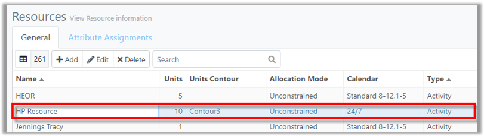
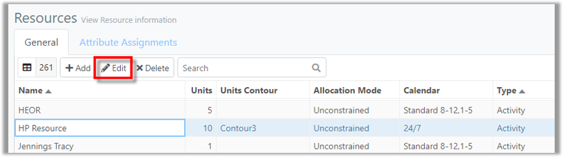
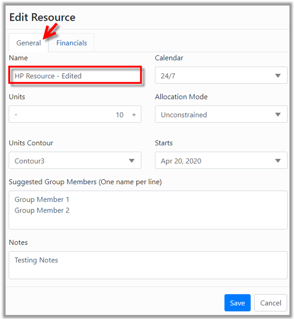
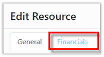
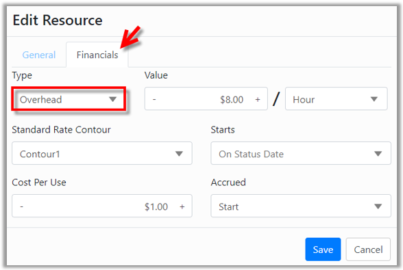
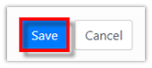
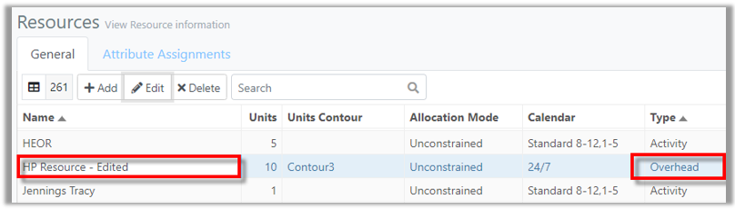



You are here: [Resources](C:/_git/ProModelAutodeskEdition/PorfolioSimulator.Help/wwwroot/Help/Docs/Resources/Resources.md) > Edit Resource

----
### _Edit Resource_ 

**1.** Select a **Resource** to be edited from the Resources table. The selected Resource is indicated with a blue highlight.

  
**2.** Select the **Edit button** located in the Resources toolbar *(alternatively, double-click the Resource row to open the Edit Resource modal)*.

  
**3.** The Edit Resource modal populates displaying the **General tab**, as depicted below. Make the desired changes to the Resource. In the
example below, the user intends to edit the **Resource Name**. 

**4.** Next, select the **Financials tab** to edit financial information *(alternatively, select **Save** if complete to close the modal)*.

**5.** Make the desired changes to the financial information. In the example below, the user intends to update the **Type field**. 

**6.** Select **Save** at the bottom-right corner of the modal once all updates are made.

**7.** The Resources table updates, displaying changes made to the revised Resource.

##
Related Content:
* [Resources (overview)](C:/_git/ProModelAutodeskEdition/PorfolioSimulator.Help/wwwroot/Help/Docs/Resources/Resources.md)
* [Add Resource](C:/_git/ProModelAutodeskEdition/PorfolioSimulator.Help/wwwroot/Help/Docs/Resources/AddResource/AddResource.md)
* [Delete Resource](C:/_git/ProModelAutodeskEdition/PorfolioSimulator.Help/wwwroot/Help/Docs/Resources/DeleteResource/DeleteResource.md)
* [Search Resources](C:/_git/ProModelAutodeskEdition/PorfolioSimulator.Help/wwwroot/Help/Docs/Resources/SearchResources/SearchResources.md)
* [Attribute Assignments](C:/_git/ProModelAutodeskEdition/PorfolioSimulator.Help/wwwroot/Help/Docs/Resources/AttributeAssignments/AttributeAssignments.md)

##

  &copy; 2020 ProModel Corporation  705 E Timpanogos Parkway  Orem, UT 84097  Support: 888-776-6633  www.promodel.com {style ="align: left"}

