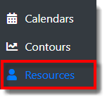
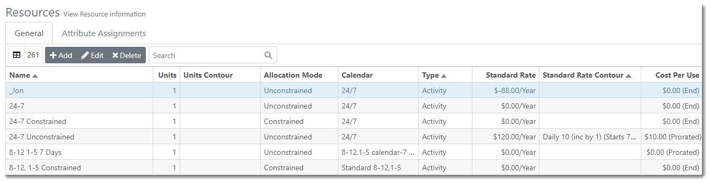



You are here: Resources

----
# **Resources** 

The Resources section of ProModel AutoCAD Edition (ProModel AutoCAD Edition) allows you to define all the resources shared across your portfolio of projects 
required to perform work on tasks. Users may add resources at any time as projects are created. 
However, the user cannot assign a resource to a project until the resource is first defined. You can also 
define general resource characteristics and assign attributes and contours to a resource.

### _**Navigation**_
**1.** After loggin into ProModel AutoCAD Edition, select the **Resources link** displayed in the navigation pane on the left-hand side of the screen.  

**2.** The user is directed to the Resources view, as depicted in the image below

### _**Terminology**_

**Name**: Each Resource requires a unique name. 
 
**Units**: The quantity of the Resource available to do work.
This value is important when the Resource has a “Constrained” Allocation Mode, and projects require 
more units of this Resource than are available.  In this case, there will be delays to any tasks that 
cannot have work performed due to a lack of available Resource units.

**Units Contour**: (Optional) The countour selected to be utilized for the Resource. 

**Allocation Mode**: Identifies whether the Resource is constrained or unconstrained. If a Resource is 
unconstrained, the “Unit” value will be ignored during simulation.  Essentially, this means that there 
is an unlimited number of this Resource to perform work on tasks.  In this case, there will never be 
delays to tasks due to over-allocated Resources.

**Calendar**: The calendar selected to be utilized for the Resource. 

**Type**:  Activity or Overhead

**Standard Rate**: (Optional) This is the Standard Rate the Resource charges per time specified. The Standard Rate is only accrued as the Resource is utilized. Therefore, if a Resource is 100% utilized for an entire year, and has a $100,000 per year rate, the Resource will accrue $100,000 in cost in that year.  However, if the same Resource is only partially used during the year, 75% for example, the Resource will only accrue $75,000 in cost for the year.  This rate can be defined by hour, day, week, month, quarter or year.

**Standard Rate Contour**: (Optional) A contour that applies to the standard rate for the resource.

**Cost Per Use**: (Optional) The cost the Resource will accrue whenever it is used on a task.  This cost is in addition to any time-based cost incurred by its “Standard Rate” and could be used to represent costs such as “start up” or “usage fee” costs.  The Cost Per Use fee can be applied to the Resource at the start of a task. The end of a task, or prorated over the duration of a task.

**Suggested Group Members**: (Optional)

---
**Related Content**:
* [Add Resource](C:/_git/ProModelAutodeskEdition/PorfolioSimulator.Help/wwwroot/Help/Docs/Resources/AddResource/AddResource.md)
* [Edit Resource](C:/_git/ProModelAutodeskEdition/PorfolioSimulator.Help/wwwroot/Help/Docs/Resources/EditResource/EditResource.md)
* [Delete Resource](C:/_git/ProModelAutodeskEdition/PorfolioSimulator.Help/wwwroot/Help/Docs/Resources/DeleteResource/DeleteResource.md)
* [Search Resources](C:/_git/ProModelAutodeskEdition/PorfolioSimulator.Help/wwwroot/Help/Docs/Resources/SearchResources/SearchResources.md)
* [Attribute Assignments](C:/_git/ProModelAutodeskEdition/PorfolioSimulator.Help/wwwroot/Help/Docs/Resources/AttributeAssignments/AttributeAssignments.md)

---

  &copy; 2020 ProModel Corporation  705 E Timpanogos Parkway  Orem, UT 84097  Support: 888-776-6633  www.promodel.com {style ="align: left"}

