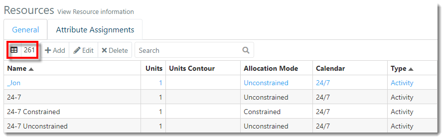
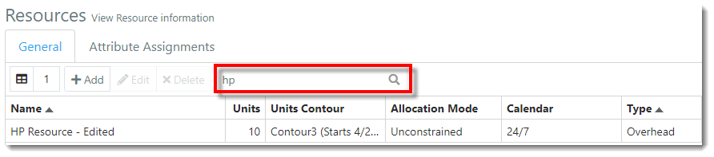
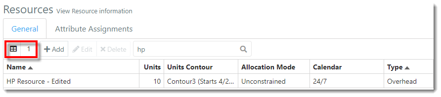
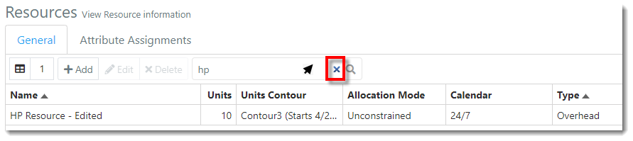



You are here: [Resources](C:/_git/ProModelAutodeskEdition/PorfolioSimulator.Help/wwwroot/Help/Docs/Resources/Resources.md) > Search Resources

----
### _Search Resources_ 

**1.** The Resources **Item Count** is displayed in the top left of the toolbar. 
This number represents the number of Resources available (261).

**2.** Users may search the Resources table by Resource name. 
Simply key in the Resource name in the **search bar** located in the toolbar. 
Search results populate as criteria is entered.  

**3.** Notice the **Item Count** is updated to reflect the number of Resources displayed in the search results (1).

**4.** To clear the search, hover the cursor over the **search bar**, then select the **X** displayed within.

##
Related Content:
* [Resources (overview)](C:/_git/ProModelAutodeskEdition/PorfolioSimulator.Help/wwwroot/Help/Docs/Resources/Resources.md)
* [Add Resource](C:/_git/ProModelAutodeskEdition/PorfolioSimulator.Help/wwwroot/Help/Docs/Resources/AddResource/AddResource.md)
* [Edit Resource](C:/_git/ProModelAutodeskEdition/PorfolioSimulator.Help/wwwroot/Help/Docs/Resources/EditResource/EditResource.md)
* [Delete Resource](C:/_git/ProModelAutodeskEdition/PorfolioSimulator.Help/wwwroot/Help/Docs/Resources/DeleteResource/DeleteResource.md)
* [Attribute Assignments](C:/_git/ProModelAutodeskEdition/PorfolioSimulator.Help/wwwroot/Help/Docs/Resources/AttributeAssignments/AttributeAssignments.md)

##

  &copy; 2020 ProModel Corporation  705 E Timpanogos Parkway  Orem, UT 84097  Support: 888-776-6633  www.promodel.com {style ="align: left"}

