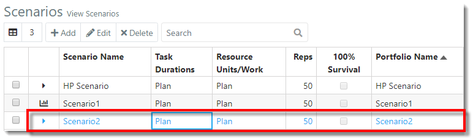
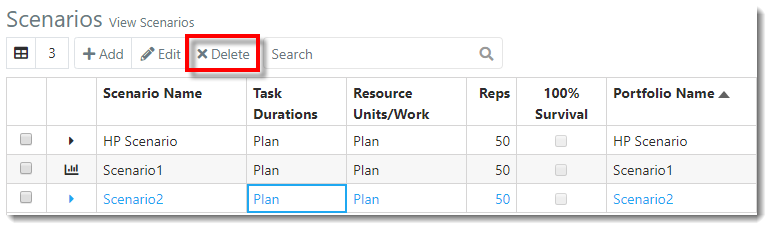
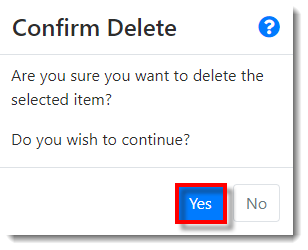
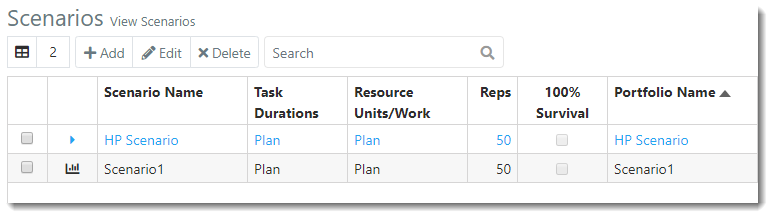



You are here: [Scenarios](C:/_git/ProModelAutodeskEdition/PorfolioSimulator.Help/wwwroot/Help/Docs/Scenarios/Scenarios.md) > Delete Scenario

----
## _**Delete Scenario**_

**1.** Select the row of a **Scenario** to be deleted from the Scenarios table. The selected Scenario is indicated via blue text.

**2.** Select the **Delete button** located in the Scenarios toolbar.

**3.** A 'Confirm Delete' modal populates. Select **Yes** to continue and delete the Scenario.

**4.** The deleted Scenario no longer appears in the Scenarios table.

---

**Related Content**: 
- [Scenarios (overview)](C:/_git/ProModelAutodeskEdition/PorfolioSimulator.Help/wwwroot/Help/Docs/Scenarios/Scenarios.md)
- [Create Scenario](C:/_git/ProModelAutodeskEdition/PorfolioSimulator.Help/wwwroot/Help/Docs/Scenarios/CreateScenario/CreateScenario.md)
- [Simulate Scenario](C:/_git/ProModelAutodeskEdition/PorfolioSimulator.Help/wwwroot/Help/Docs/Scenarios/RunScenario/RunScenario.md) 
- [Edit Scenario](C:/_git/ProModelAutodeskEdition/PorfolioSimulator.Help/wwwroot/Help/Docs/Scenarios/EditScenario/EditScenario.md)
- [Search Scenarios](C:/_git/ProModelAutodeskEdition/PorfolioSimulator.Help/wwwroot/Help/Docs/Scenarios/SearchScenarios/SearchScenarios.md)
- [Throughput Reports](C:/_git/ProModelAutodeskEdition/PorfolioSimulator.Help/wwwroot/Help/Docs/Scenarios/ThroughputReports/ThroughputReports.md)
- [Resource Reports](C:/_git/ProModelAutodeskEdition/PorfolioSimulator.Help/wwwroot/Help/Docs/Scenarios/ResourceReports/ResourceReports.md)
- [Portfolio Gantt](C:/_git/ProModelAutodeskEdition/PorfolioSimulator.Help/wwwroot/Help/Docs/Scenarios/PortfolioGantt/PortfolioGantt.md)
- [Financial Reports](C:/_git/ProModelAutodeskEdition/PorfolioSimulator.Help/wwwroot/Help/Docs/Scenarios/FinancialReports/FinancialReports.md)

---

 &copy; 2020 ProModel Corporation  705 E Timpanogos Parkway  Orem, UT 84097  Support: 888-776-6633  www.promodel.com  

