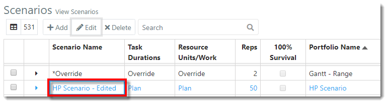

You are here: [Scenarios](C:/_git/ProModelAutodeskEdition/PorfolioSimulator.Help/wwwroot/Help/Docs/Scenarios/Scenarios.md) > Edit Scenario

----
## _**Edit Scenario**_

**1.** Select the row of a **Scenario** to be edited from the Scenarios table. The selected Scenario is indicated via blue text.

**2.** Next, select the **Edit button** located in the Scenarios toolbar *(alternatively, double-click the Scenario row to open the Edit Scenario modal)*.

**3.** The Edit Scenario modal populates, displaying the **General tab**. Make the desired changes to the Scenario. In the example below, the user intends to modify the **Scenario Name**.

**4.** Next, select the **Projects tab** to edit Projects included in the Scenario *(if no changes to Projects are needed, select **Save**  in the lower-right corner to close the modal)*.

**5.** Add or remove Projects to/from the Scenario as preferred. In the example below, the user intends to remove a Project from the Scenario. To do so, select a **Project** from the Scenario Projects list (indicated with blue text), then select the **left-facing arrow**.

**6.** The Project is removed from the Scenario Projects list. Once all desired changes have been made to the Scenario, select **Save** in the lower-right corner of the modal.

**7.** The changes made are saved and reflected in the updated Scenarios table.

---

**Related Content**:
- [Scenarios (overview)](C:/_git/ProModelAutodeskEdition/PorfolioSimulator.Help/wwwroot/Help/Docs/Scenarios/Scenarios.md)
- [Create Scenario](C:/_git/ProModelAutodeskEdition/PorfolioSimulator.Help/wwwroot/Help/Docs/Scenarios/CreateScenario/CreateScenario.md)
- [Simulate Scenario](C:/_git/ProModelAutodeskEdition/PorfolioSimulator.Help/wwwroot/Help/Docs/Scenarios/RunScenario/RunScenario.md) 
- [Delete Scenario](C:/_git/ProModelAutodeskEdition/PorfolioSimulator.Help/wwwroot/Help/Docs/Scenarios/DeleteScenario/DeleteScenario.md)
- [Search Scenarios](C:/_git/ProModelAutodeskEdition/PorfolioSimulator.Help/wwwroot/Help/Docs/Scenarios/SearchScenarios/SearchScenarios.md)
- [Throughput Reports](C:/_git/ProModelAutodeskEdition/PorfolioSimulator.Help/wwwroot/Help/Docs/Scenarios/ThroughputReports/ThroughputReports.md)
- [Resource Reports](C:/_git/ProModelAutodeskEdition/PorfolioSimulator.Help/wwwroot/Help/Docs/Scenarios/ResourceReports/ResourceReports.md)
- [Portfolio Gantt](C:/_git/ProModelAutodeskEdition/PorfolioSimulator.Help/wwwroot/Help/Docs/Scenarios/PortfolioGantt/PortfolioGantt.md)
- [Financial Reports](C:/_git/ProModelAutodeskEdition/PorfolioSimulator.Help/wwwroot/Help/Docs/Scenarios/FinancialReports/FinancialReports.md)

--- 

 &copy; 2020 ProModel Corporation  705 E Timpanogos Parkway  Orem, UT 84097  Support: 888-776-6633  www.promodel.com {style ="align: left"}

