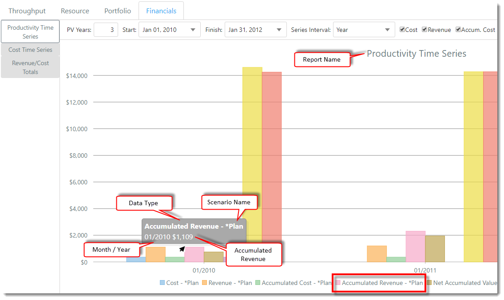

You are here: [Scenarios](C:/_git/ProModelAutodeskEdition/PorfolioSimulator.Help/wwwroot/Help/Docs/Scenarios/Scenarios.md) > Financial Reports

----

## _**Financial Reports**_

The Financials tab consists of three different reports:
- Productivity Time Series
- Cost Time Series
- Revenue/Cost Totals

### _Getting Started_
**1.** In the Scenarios table, select the checkbox to the left of each Scenario to be included in the Financial reports.

")

**2.** Select the **Financials tab**. The default view is the **Productivity Time Series** report. 

")

**3.** The selected Scenario(s) will load in the reports section beneath the Scenarios table. **Note: If no applicable data is present in the Scenario(s) selected, the text "No Data" will display in the report area.*

**4.** Each report includes a color-coded legend displayed beneath the chart, as depicted in the image below (legends vary by report). In the examples below, one Scenario is included: 
- *Plan

### **Productivity Time Series**
This report shows various financial data over time, including cost, revenue, accumulated cost, accumulated revenue, net accumulated value, present value (pv) cost,  pv revenue and net pv.

**1.** Select the **Financials tab**. The default view is the **Productivity Time Series** report.

**2.** Key in the desired number of **PV (Present Value) Years**. In the example below, the user would like to view the Present Value data for each year, for the first three years (from the selected Start Date).

**3.** Select the desired report **Start Date** and **Finish Date**. This selection determines the period of time that will be represented in the chart. In the examples below, the report will cover the time period from January 1, 2010 - January 31, 2012.

**4.** Select the **Series Interval** (Month / Quarter / Year). This selection determines the level of detail shown in the report. In this example, the user would like to view the overall data for each year of the selected time period.

**5.** Select the checkbox of each desired **Data Type** to be displayed in the chart. In this example, the user would like to view all Data Types.

**6.** Hover the cursor over a **bar** to display the corresponding data. In the example below, the Scenario accumulated $1,109 in revenue by January 2010. 

### **Cost Time Series**
This report shows the portfolio cost over time.

**1.** Select the **Financials tab**, then select the **Cost Time Series link**.

**2.** Select the preferred **Series Interval** (Month / Quarter / Year). This selection determines the level of detail shown in the report. In this example, the user would like to view the overall data for each year of the selected time period.

**3.** Select the desired report **Start Date** and **Finish Date**. This selection determines the period of time that will be represented in the chart. In the examples below, the report will cover the time period from January 1, 2009 - January 1, 2015.

**4.** Select the preferred **Data Types** to be displayed in the report. In this example, the user would like to view both Cost and Accumulated Cost data points. 

**5.** Next, select the **Resource Costs button** located at the top-right corner of the chart. 

**6.** The 'Advanced Options' modal populates. Here, the user can select which Resource Costs should be included in the Cost Time Series chart. In this example, the user would like to include all Resource Costs. Click the **Select All option**, then select **Done**.

**7.** Select the **Fixed Costs button**  located at the top-right corner of the chart. 

**8.** The 'Advanced Options' modal populates. Here, the user can select which Fixed Costs should be included in the Cost Time Series chart. In this example, the user would like to include all Fixed Costs. Click the **Select All option**, then select **Done**.

**9.** Hover the cursor over a **data point** displayed in the report to view the corresponding information. In the example below, the Scenario accumulated costs of $360 by the year 2010.

### **Revenue/Cost Totals**
This report allows you to analyze the total cost and revenues accrued in any given time frame. This report also supports percentiles.

**1.** Select the **Financials tab**, then select the **Revenue/Cost Totals link**.

**2.** Select the desired **Reporting Level** (Project / Level 1). This selection determines whether project or task values are displayed within the chart. In the examples below, we will review project level data.

**3.** Select the preferred report **Start Date** and **Finish Date**. To ensure the totals displayed are accurate, please enter the earliest project start date and the latest project finish date included within the Scenario.

**4.** Select the preferred **Data Types** to be displayed in the report. In this example, the user would like to view both Cost and Revenue totals.

**5.** Hover the cursor over a **bar** within the chart to view the corresponding data. In the example below, the Scenario generated a total of $23,909 in revenue. 

---

**Related Content**:
- [Scenarios (overview)](C:/_git/ProModelAutodeskEdition/PorfolioSimulator.Help/wwwroot/Help/Docs/Scenarios/Scenarios.md)
- [Create Scenario](C:/_git/ProModelAutodeskEdition/PorfolioSimulator.Help/wwwroot/Help/Docs/Scenarios/CreateScenario/CreateScenario.md)
- [Simulate Scenario](C:/_git/ProModelAutodeskEdition/PorfolioSimulator.Help/wwwroot/Help/Docs/Scenarios/RunScenario/RunScenario.md) 
- [Edit Scenario](C:/_git/ProModelAutodeskEdition/PorfolioSimulator.Help/wwwroot/Help/Docs/Scenarios/EditScenario/EditScenario.md)
- [Delete Scenario](C:/_git/ProModelAutodeskEdition/PorfolioSimulator.Help/wwwroot/Help/Docs/Scenarios/DeleteScenario/DeleteScenario.md)
- [Search Scenarios](C:/_git/ProModelAutodeskEdition/PorfolioSimulator.Help/wwwroot/Help/Docs/Scenarios/SearchScenarios/SearchScenarios.md)
- [Throughput Reports](C:/_git/ProModelAutodeskEdition/PorfolioSimulator.Help/wwwroot/Help/Docs/Scenarios/ThroughputReports/ThroughputReports.md)
- [Resource Reports](C:/_git/ProModelAutodeskEdition/PorfolioSimulator.Help/wwwroot/Help/Docs/Scenarios/ResourceReports/ResourceReports.md)
- [Portfolio Gantt](C:/_git/ProModelAutodeskEdition/PorfolioSimulator.Help/wwwroot/Help/Docs/Scenarios/PortfolioGantt/PortfolioGantt.md)

---

 &copy; 2020 ProModel Corporation  705 E Timpanogos Parkway  Orem, UT 84097  Support: 888-776-6633  www.promodel.com {style ="align: left"}

