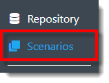
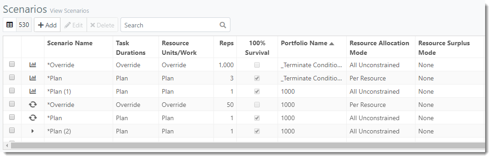



 

You are here: Scenarios 

----

# **Scenarios** 

A Scenario is a projected sequence of events with different detailed plans or possibilities. ProModel AutoCAD Edition allows users to create different Scenarios for their Portfolios and run simulations of these Scenarios to see how changes in task time variability, resource quantities, etc. affect the outcome of the Portfolio.
Once a Scenario's simulation is complete, the user may view the Throughput, Resource and Financial Reports below the Scenarios table, along with the Portfolio Gantt.

### _**Navigation**_

**1.** Select the **Scenarios link** in the navigation pane on the left-hand side of the screen.

**2.** The user is directed to the Scenarios view, as depicted in the image below.

### _**Terminology**_

- **Scenario Name**: Name of the Scenario; Scenarios that were created by default are preceeded by an asterisk.

- **Task Durations**: The duration of project tasks during simulation can either be the duration defined in the tasks "Plan" column or the "Override" column.
- **Resource Units/Work**: The simulation will use the resource unit or work values for assignments from either the assignment's "Plan" or "Override" columns.
- **Reps**: Replications (reps) determine how many times the Scenario will run through the simulation engine. You will want to run a significant number of replications to yield meaningful statistical results, because of the statistical distributions. If you have disabled variability, Plan duration and Plan work values will be used to calculate Cycle Time and Work instead of distributions; however, survival percentages, revenue, and dependency lag will still apply and vary from replication to replication.
- **100% Survival**: Check this option's selection box to have all tasks always survive for this Scenario. If this option is unchecked, the values entered in the survival column for each task will be used.
- **Portfolio Name**: Name of the portfolio.
- **Resource Allocation Mode**: Indicates how Scenario resources are allocated. All Constrained, All Constrained Leveling, All Unconstrained, or Per Resource.
- **Resource Surplus Mode**: Indicates the mode the simulation engine may use to re-assign resources if there is a surplus. Choices are; None, Recoup, or Accelerate:
  - **None**: No surplus resources can be assigned.
  
  - **Recoup**: Allows tasks to capture more resources than assigned in order to make up delayed work.
  - **Accelerate**: Allows tasks to capture more resources than assigned in order to complete tasks ahead of schedule. 

- **Resource Surplus Leveling %**: The Leveling % specifies an amount by which to multiply the resource requirement for each 
resource. This percent setting limits the amount a specific resource can be assigned to each task 
to balance the surplus.
- **Task Behavior**: Choose from event-based or work-based. Event-based tasks will start when its start condition is satisfied. Work-based tasks start when work actually begins on the task.
- **APR**: Annual Percentage Rate.
- **Last Run**: Date and time the Scenario was last run.
- **Project Count**: Number of projects included in the Scenario.
- **Status Date**: The simulation start date.
- **Run Length**: Length of time the simulation is to run. User can specify by days, weeks, months, quarters, or years.
- **Reporting Interval**: The intervals of time used to group the data in time series reports. Can be monthly, quarterly, or yearly.
- **Time Series**: The length of time for the data collected during simulation starting from the status date to support resource time series reports.
- **Created By**: User who created the scenario.

---

**Related Content**: 
- [Create Scenario](C:/_git/ProModelAutodeskEdition/PorfolioSimulator.Help/wwwroot/Help/Docs/Scenarios/CreateScenario/CreateScenario.md)
- [Simulate Scenario](C:/_git/ProModelAutodeskEdition/PorfolioSimulator.Help/wwwroot/Help/Docs/Scenarios/RunScenario/RunScenario.md) 
- [Edit Scenario](C:/_git/ProModelAutodeskEdition/PorfolioSimulator.Help/wwwroot/Help/Docs/Scenarios/EditScenario/EditScenario.md)
- [Delete Scenario](C:/_git/ProModelAutodeskEdition/PorfolioSimulator.Help/wwwroot/Help/Docs/Scenarios/DeleteScenario/DeleteScenario.md)
- [Search Scenarios](C:/_git/ProModelAutodeskEdition/PorfolioSimulator.Help/wwwroot/Help/Docs/Scenarios/SearchScenarios/SearchScenarios.md)
- [Throughput Reports](C:/_git/ProModelAutodeskEdition/PorfolioSimulator.Help/wwwroot/Help/Docs/Scenarios/ThroughputReports/ThroughputReports.md)
- [Resource Reports](C:/_git/ProModelAutodeskEdition/PorfolioSimulator.Help/wwwroot/Help/Docs/Scenarios/ResourceReports/ResourceReports.md)
- [Portfolio Gantt](C:/_git/ProModelAutodeskEdition/PorfolioSimulator.Help/wwwroot/Help/Docs/Scenarios/PortfolioGantt/PortfolioGantt.md)
- [Financial Reports](C:/_git/ProModelAutodeskEdition/PorfolioSimulator.Help/wwwroot/Help/Docs/Scenarios/FinancialReports/FinancialReports.md)

---

 &copy; 2020 ProModel Corporation  705 E Timpanogos Parkway  Orem, UT 84097  Support: 888-776-6633  www.promodel.com 

