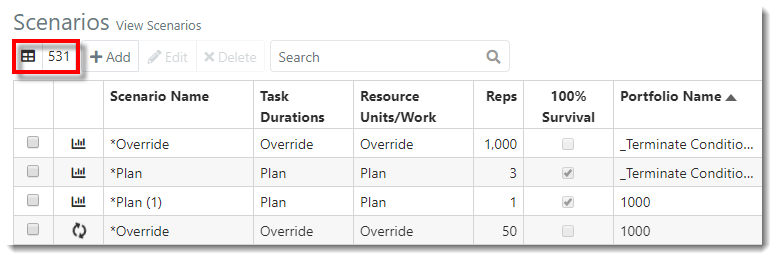

You are here: [Scenarios](C:/_git/ProModelAutodeskEdition/PorfolioSimulator.Help/wwwroot/Help/Docs/Scenarios/Scenarios.md) > Search Scenarios

----
## _**Search Scenarios**_

**1.** The Scenarios **Item Count** is displayed in the top left of the toolbar. 
This number represents the number of Scenarios available (531). 

**2.** Users may search the Scenarios table by entering criteria in the **search bar**, located in the toolbar. 
Search results populate as criteria is entered. 

**3.** Notice the **Item Count** updates to reflect the number of Scenarios displayed in the search results (2).

**4.** To clear the search, hover the cursor over the **search bar**, then select the **X** displayed within.

##
**Related Content**:
- [Scenarios (overview)](C:/_git/ProModelAutodeskEdition/PorfolioSimulator.Help/wwwroot/Help/Docs/Scenarios/Scenarios.md)
- [Create Scenario](C:/_git/ProModelAutodeskEdition/PorfolioSimulator.Help/wwwroot/Help/Docs/Scenarios/CreateScenario/CreateScenario.md)
- [Simulate Scenario](C:/_git/ProModelAutodeskEdition/PorfolioSimulator.Help/wwwroot/Help/Docs/Scenarios/RunScenario/RunScenario.md) 
- [Edit Scenario](C:/_git/ProModelAutodeskEdition/PorfolioSimulator.Help/wwwroot/Help/Docs/Scenarios/EditScenario/EditScenario.md)
- [Delete Scenario](C:/_git/ProModelAutodeskEdition/PorfolioSimulator.Help/wwwroot/Help/Docs/Scenarios/DeleteScenario/DeleteScenario.md)
- [Throughput Reports](C:/_git/ProModelAutodeskEdition/PorfolioSimulator.Help/wwwroot/Help/Docs/Scenarios/ThroughputReports/ThroughputReports.md)
- [Resource Reports](C:/_git/ProModelAutodeskEdition/PorfolioSimulator.Help/wwwroot/Help/Docs/Scenarios/ResourceReports/ResourceReports.md)
- [Portfolio Gantt](C:/_git/ProModelAutodeskEdition/PorfolioSimulator.Help/wwwroot/Help/Docs/Scenarios/PortfolioGantt/PortfolioGantt.md)
- [Financial Reports](C:/_git/ProModelAutodeskEdition/PorfolioSimulator.Help/wwwroot/Help/Docs/Scenarios/FinancialReports/FinancialReports.md)

---

  &copy; 2020 ProModel Corporation  705 E Timpanogos Parkway  Orem, UT 84097  Support: 888-776-6633  www.promodel.com {style ="align: left"}

