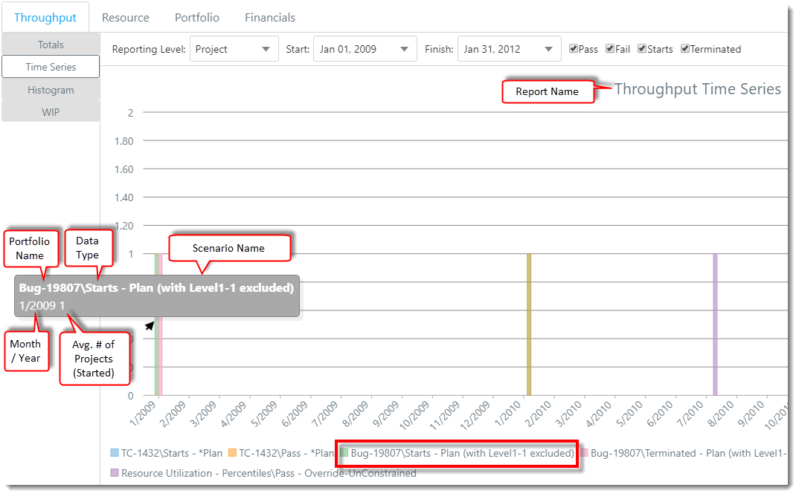
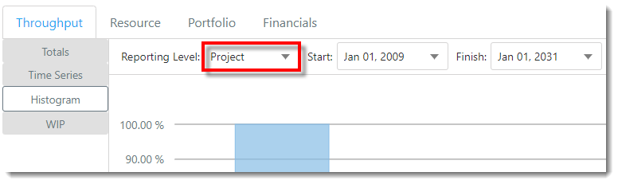
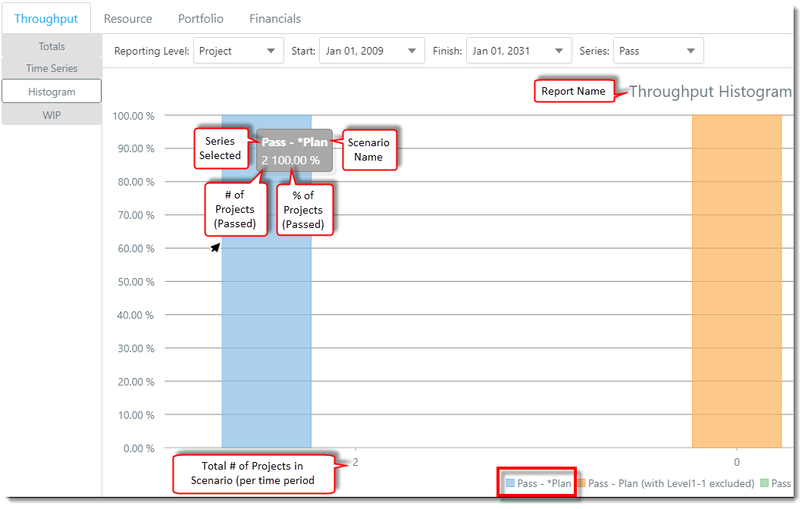

You are here: [Scenarios](C:/_git/ProModelAutodeskEdition/PorfolioSimulator.Help/wwwroot/Help/Docs/Scenarios/Scenarios.md) > Throughput Reports

----

## _**Throughput Reports**_ 

The Throughput reports show the average of passed, failed, started or terminated projects, tasks, or subtasks (dependent on Reporting Level selected) for all replications. This information can be shown as a Total, Time Series, Histogram, or Work in Progress (WIP) chart. The Throughput chart will include historical data, which is information contained in the portfolio which has occurred prior to the simulation start date. 

### _Getting Started_
**1.** In the Scenarios table, select the checkbox to the left of each Scenario to be included in the Throughput reports.

**2.** The default report view is the **Throughput Totals** report. 

")

**3.** The selected Scenario(s) will load in the reports section beneath the Scenarios table. **Note: If no applicable data is present in the Scenario(s) selected, the text "No Data" will display in the report area.*

**4.** Each report includes a color-coded legend displayed beneath the chart, as depicted in the image below (legends vary by report). In the examples below, three Scenarios are included: 
- *Plan 
- Plan (with Level1-1 excluded)  
- Override-UnConstrained 

### **Throughput Totals**
The Throughput Totals report shows the average number of passed, failed, started or terminated projects or tasks (dependent on Reporting Level selected) within the time period selected for all replications. In this report the x-axis represents the data type (Pass / Fail / Starts / Terminated), while the y-axis represents the average number of projects.

**1.** The **Throughput tab** defaults to display the **Totals Report**, as depicted below.  

**2.** Select the desired **Reporting Level** (Project / Level 1 / Level 2 / Level 3). This selection determines whether project, task, or subtask values are displayed within the chart. In the examples below, we will review project level data.

**3.** Select the desired report **Start Date** and **Finish Date**. This selection determines the period of time that will be represented in the chart. In the examples below, the report will cover the time period from January 1, 2009 - January 1, 2031.

**4.** Select the preferred **data type checkboxes** (Pass / Fail / Starts / Terminated ) to display the corresponding bar charts. The data type names are displayed at the bottom of the report, beneath the corresponding bars.

**5.** Hover the cursor over a **bar** to display the corresponding data. In the example below, the user has hovered the cursor over the "*Plan" Scenario's "Pass" data type bar. The hover text indicates that on average, two Projects passed within the Scenario for all replications within the specified time period.

### **Throughput Time Series**
The Throughput Time Series chart shows the average number of passed, failed, started and terminated projects or tasks (dependent on Reporting Level selected) for all replications over time (per time period selected). The x-axis in this chart represents the date (month/year), while the y-axis represents the average number of projects.

**1.** Select **Time Series link** located in the **Throughput tab**. 

**2.** Select the desired **Reporting Level** (Project / Level 1 / Level 2 / Level 3).

**3.** Select the desired report **Start Date** and **Finish Date**.

**4.** Select the preferred **data type checkboxes** (Pass / Fail / Starts / Terminated ) to display the corresponding bar charts. 

**5.** Hover the cursor over a **bar** to display the corresponding data. In the example below, the user has hovered the cursor over the "*Plan" Scenario's "Pass" data type bar. The hover text indicates that on average, two projects passed within the Scenario (and selected time-frame) for all replications.

### **Throughput Histogram**
The Throughput Histogram shows the frequency of the number of projects or tasks (dependent on Reporting Level selected) that will pass, fail, start or be terminated over the selected time period. In this report, the x-axis represents the number of projects within the Scenario, while the y-axis represents the percentage of those projects that will pass, fail, start or be terminated (Series drop-down) during the time period selected.

**1.** Select the **Histogram link** located in the **Throughput tab**.

**2.** Select the desired **Reporting Level** (Project / Level 1 / Level 2 / Level 3).

**3.** Select the desired report **Start Date** and **Finish Date**.

**4.** Select the desired **Series** (Pass / Fail / Starts / Terminated).

**5.** Hover the cursor over a **bar** to display the corresponding data. In the example below, the "*Plan" Scenario contains two projects that pass 100% during the time period selected. 

### **Throughput WIP**
The Throughput WIP shows the work in progress. In this report, the x-axis represents time (based on the Series Interval selected), while the y-axis represents the number of projects or tasks (dependent on Reporting Level selected) in progress.

**1.** Select the **Histogram link** located in the **Throughput tab**.

**2.** Select the desired **Reporting Level** (Project / Level 1 / Level 2 / Level 3).

**3.** Select the desired report **Start Date** and **Finish Date**.

**4.** Select the desired **Series Interval** (Month / Quarter / Year). This selection will determine the level of detail shown in the report. In this example, the user would like to view the data for each month of the selected time period.

**5.** Hover the cursor over a **bar** to display the corresponding data. 

---

**Related Content**:
- [Scenarios (overview)](C:/_git/ProModelAutodeskEdition/PorfolioSimulator.Help/wwwroot/Help/Docs/Scenarios/Scenarios.md)
- [Create Scenario](C:/_git/ProModelAutodeskEdition/PorfolioSimulator.Help/wwwroot/Help/Docs/Scenarios/CreateScenario/CreateScenario.md)
- [Simulate Scenario](C:/_git/ProModelAutodeskEdition/PorfolioSimulator.Help/wwwroot/Help/Docs/Scenarios/RunScenario/RunScenario.md) 
- [Edit Scenario](C:/_git/ProModelAutodeskEdition/PorfolioSimulator.Help/wwwroot/Help/Docs/Scenarios/EditScenario/EditScenario.md)
- [Delete Scenario](C:/_git/ProModelAutodeskEdition/PorfolioSimulator.Help/wwwroot/Help/Docs/Scenarios/DeleteScenario/DeleteScenario.md)
- [Search Scenarios](C:/_git/ProModelAutodeskEdition/PorfolioSimulator.Help/wwwroot/Help/Docs/Scenarios/SearchScenarios/SearchScenarios.md)
- [Resource Reports](C:/_git/ProModelAutodeskEdition/PorfolioSimulator.Help/wwwroot/Help/Docs/Scenarios/ResourceReports/ResourceReports.md)
- [Portfolio Gantt](C:/_git/ProModelAutodeskEdition/PorfolioSimulator.Help/wwwroot/Help/Docs/Scenarios/PortfolioGantt/PortfolioGantt.md)
- [Financial Reports](C:/_git/ProModelAutodeskEdition/PorfolioSimulator.Help/wwwroot/Help/Docs/Scenarios/FinancialReports/FinancialReports.md)

---

 &copy; 2020 ProModel Corporation  705 E Timpanogos Parkway  Orem, UT 84097  Support: 888-776-6633  www.promodel.com {style ="align: left"}

