

You are here: [Introduction](/pmacad/help/topic?page=Help/Docs/PMADHelpHome.md)/[Getting Started](/pmacad/help/topic?page=Help/Docs/GettingStarted/GettingStarted.md) > Simulation Results

# **Simulation Results**
***

 

A large part of making the most out of your ProModel AutoCAD® Edition software is knowing how to interpret the results of your simulation. 
This section will include an introduction about the different ways that simulation results are presented, as well as the tools that are available to you for editing and saving your simulation results. 
For more detailed information about how to use Output Viewer, select the **Help** icon in the upper right corner to open a detailed help guide. 

To access your simulation results after running a simulation, select **Yes** when prompted by the window that appears at the end of a simulation. 

 

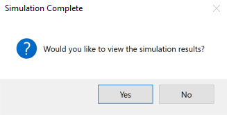

 
 

You may also select the **Output Viewer** icon in the ProModel ribbon to see the results from your most recent simulation. 

 

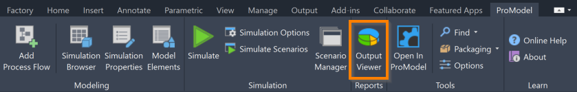

 
 

If you hover over the **Output Viewer** icon, you will see a description of the tool as well as the command **PMOutputViewer**. 
Typing this command into the command box is another way to open your most recent simulation results. 

When **Output Viewer** first opens, it will display a pre-made report with a selection of results. 
The following section will describe what a report is and what tools you can use to edit your reports. 
Information about particular charts and tables will be included [later in this guide](/pmacad/help/topic?page=Help/Docs/SimulationResults/Simulation_Results.md#Charts_and_Tables).  

 

## Reports
 

As you first open **Output Viewer** to view your simulation results, a report will be created for you named **Report1**.

 

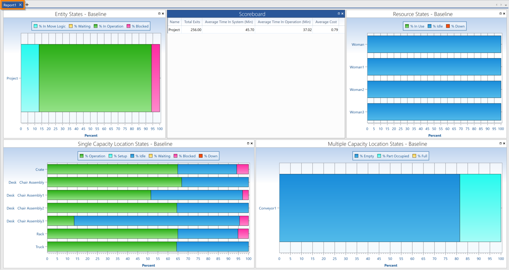

 
 

A report is a collection of tables and charts that you can create to display your desired simulation results. 
You may edit the initial report that is created for you or create new reports to display your desired information.  

To add a new report, press the “**+**” button located above the report, table or chart that is currently displayed. 

 

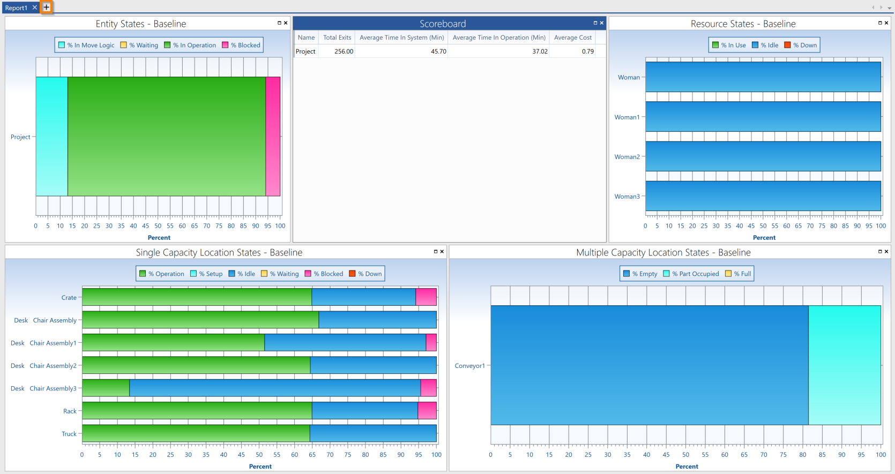

 
 

To rename a report, double-click on the report’s name to open a new window. 
Type in your desired report name and select **OK** or press **Enter** on your keyboard to confirm. 
You may also select **Cancel** to exit out of the naming process. 

To remove a table or chart from a report, select the “**x**” button in the corner of any table or chart. 

 

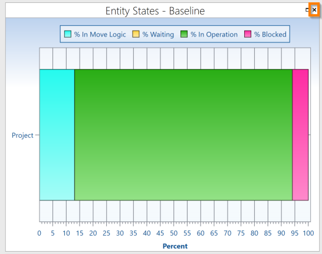

 
 

To display a table or chart on its own full screen, select the **Full Screen** button located next to the “**x**” button.

 

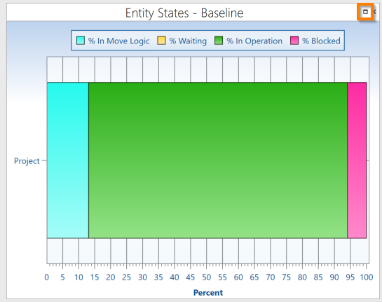

 
 

To change where a table or chart is displayed on a report, click and drag a table or chart at the header where the title is displayed. 
As you are dragging a table or chart, arrows will appear over the report to indicate different display options for the item you are moving. 
Move your mouse to one of these arrows and release to drop the table or chart in the indicated area.  

 

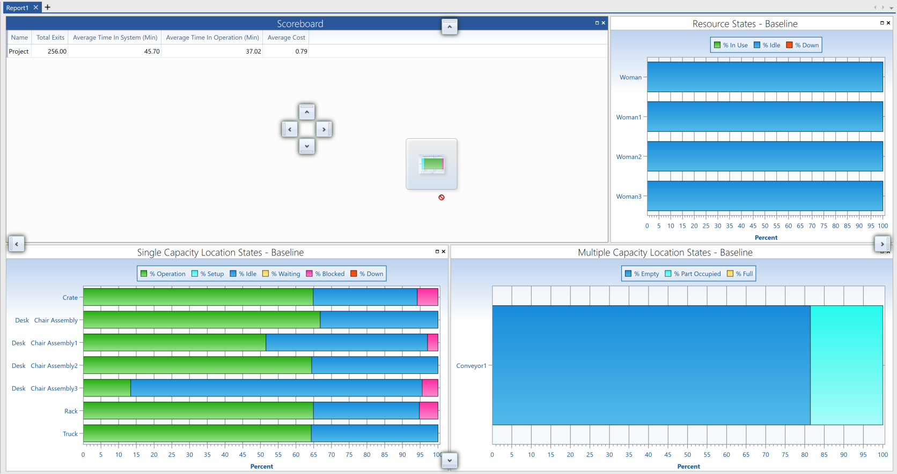

 
 

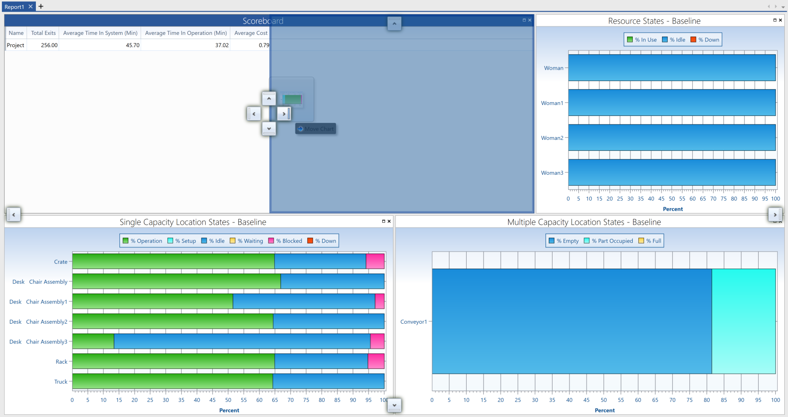

 
 

To change how large a table or chart is on a report, hover over the edges of the table or chart and click and drag to resize the item. 

To add a new table or chart to a report, locate the corresponding icon for the table or chart you wish you add under the **Charts** tab and drag it onto the report area. 
As you are dragging a table or chart, arrows will appear over the report to indicate different display options for the item you are moving. 
Move your mouse to one of these arrows and release to drop the table or chart in the indicated area. 

You may also select the icons of tables and charts to view them individually in their own separate tab outside of any report. 

 

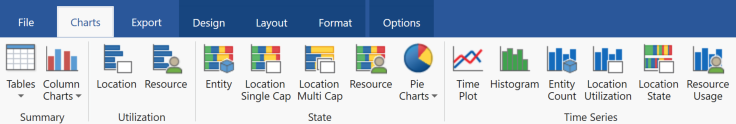

 
 

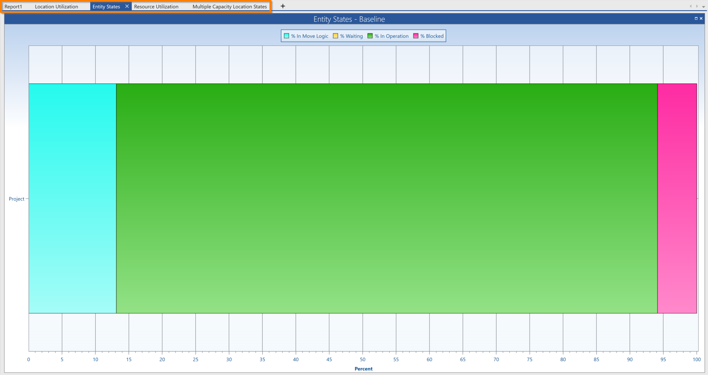

 
 

Right-click on a table or chart to see text and stylistic options.

 

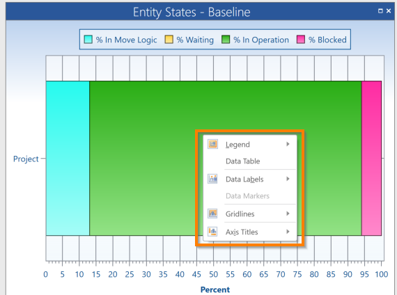

 
 

If a table or chart displays the message “**No data available for the options selected in the filter**” it either means that the necessary components for that table or chart do not exist in the model, or that they have been deselected in the **Output Viewer Filter**.

 

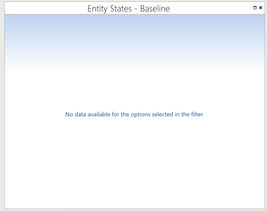

 
 

The **Output Viewer Filter** is located to the left of the report, table or chart that is currently being displayed.  

 

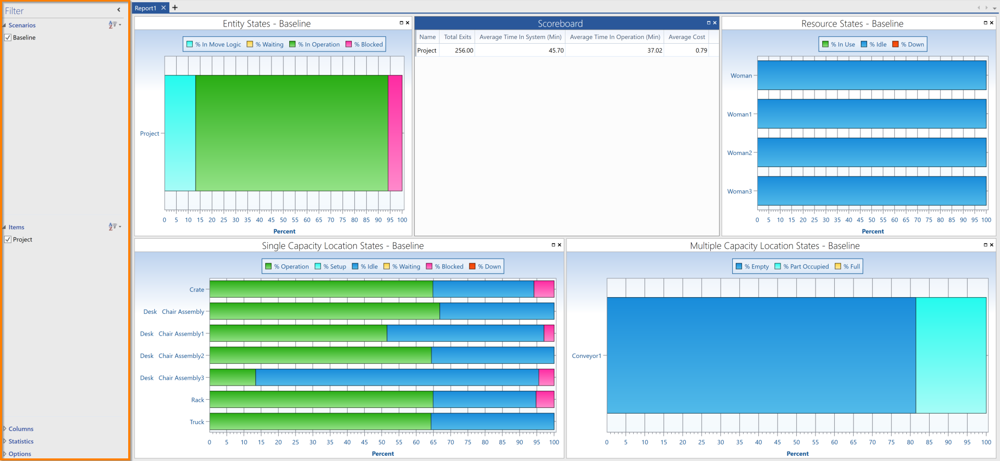

 
 

The Filter is used to determine what types of information and what items from your model are included in a table or chart. 
Click on a table or chart in a report to view it’s Filter information. 
The Filter is also available when you are viewing a table or chart individually. 

The **Output Viewer Filter** includes a collection of sections that varies based on what type of table or chart you have selected. 
Click on a section to expand it and display the information within the section.

 

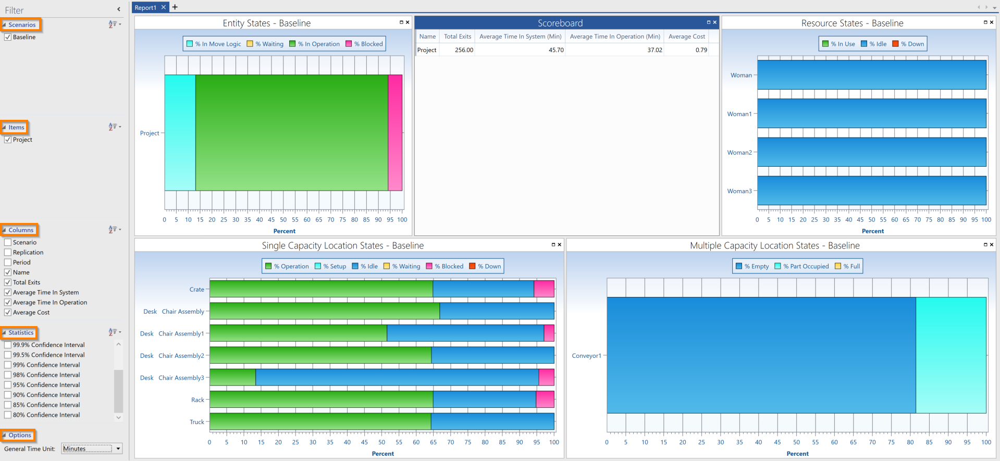

 
 

Each section includes a list of model items, options for a table or chart, or statistical settings that you may click to select or deselect to add or remove the item from your table or chart. 
The exception is the **Options** section, which will contain different drop-down menus of options depending on what type of table or chart you have selected.

Use the **Sort** button to the right of a section name to sort the items within a section based on the selectable options.  

 

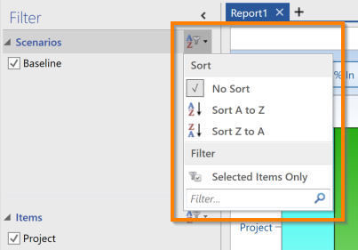

 
 

#### Report Tools
 

To save the report that you are currently working on, select the **Save** button unter the **File** tab. 
The file will save with the **.pmov** extension. 

To open a previous file in **Output Viewer**, select the **Open** option from the **File** tab to open any of your other **.pmov** files. 

Use the **Data Sources** option under the **File** tab to add or remove Data Sources to and from your report. 

Select the **About** option under the **File** tab to see information about **Output Viewer**, such as the version number. 

To exit **Output Viewer**, select the **Exit Output Viewer** option under the **File** tab.

Under the **Export** tab, there are options to export different information about your simulation to your clipboard or to Excel. 

To copy chart data to your clipboard, select a chart from your report or a chart that you are viewing individually and select the **Chart Data** button in the **Clipboard** section. 

To place a picture of a chart onto your clipboard, select a chart from your report or a chart that you are viewing individually and select the **Chart** option from the **Picture** button’s drop-down menu. 

To place a picture of an entire report onto your clipboard, select a report and click the **Report** option from the **Picture** button’s drop-down menu. 

To export data from a chart to Excel, select a chart from your report or a chart that you are viewing individually and select the **Chart** option from the drop-down menu of the **Chart Data** button in the **Excel** section. 

To export data from a single report to Excel, select a report and click the **Report** option from the drop-down menu of the **Chart Data** button in the **Excel** section.

To export data from all of your created reports to Excel, select the **All** option from the drop-down menu of the **Chart Data** button in the Excel section.  

To export raw summary data to Excel, select the **Summary Data** button. 

To export raw time series data to Excel, select the **Time Series Data** button. 

Which tools are available to you in the ribbon depends on whether you have a chart or a table selected. 
If you have a chart selected, you will be able to change the chart’s colors, type, layout and format using the **Chart Tools** section. 
If you have a table selected, you will be able to change the table’s format using the **Table Tools** section. 

 

## Charts and Tables
 

This section contains an overview of the most commonly used types of tables and charts. 
For a more extensive explanation of the tables and charts available in **Output Viewer**, see the [Output Viewer Help Guide](https://www.promodel.com/onlinehelp/outputviewer/51/).

 

#### Summaries
 

Summary tables and charts give a basic summary of useful information for your Locations, Entities, Resources and Variables. 
Summary tables display a collection of numbers to convey a collection of information, while summary charts use bar graphs to visually display a single piece of information at a time. 
Use the **Output Viewer Filter** to change what information is displayed in a summary table or chart.

 

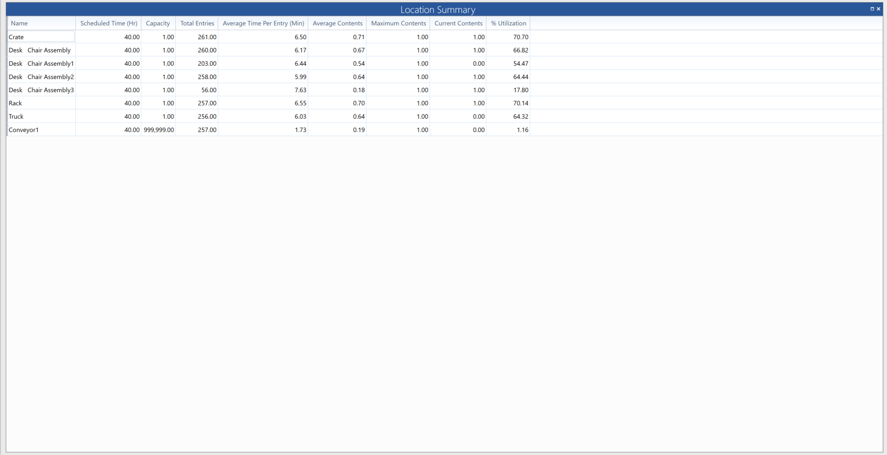

 
 

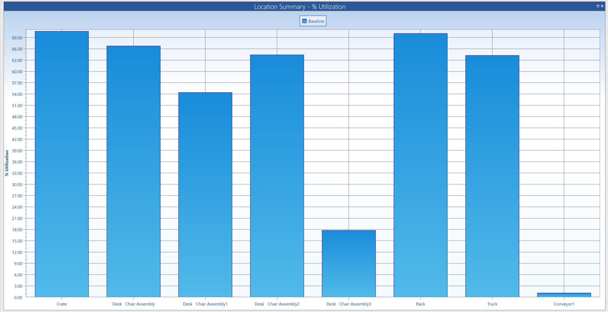

 
 

#### States
 

State tables and charts give percentage values for how much time an Entity, Location or Resource spent in each state. 
Entities, Locations and Resources each have a different collection of states that are observed. 
For more information on which actions are included in each state, see the [Output Viewer Help Guide](https://www.promodel.com/onlinehelp/outputviewer/51/). 

State tables display a collection of numerical percentages to convey state information. 
State column charts use bar graphs to visually display information for a single state at a time. 
The charts in the **State** section allow you to view a visual representation of all of the state percentages at once. 
Use the **Output Viewer Filter** to change what information is displayed in a state table or chart. 

 

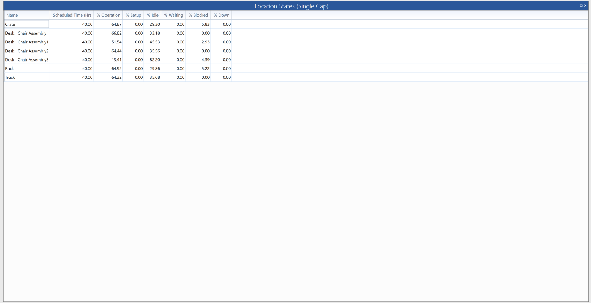

 
 

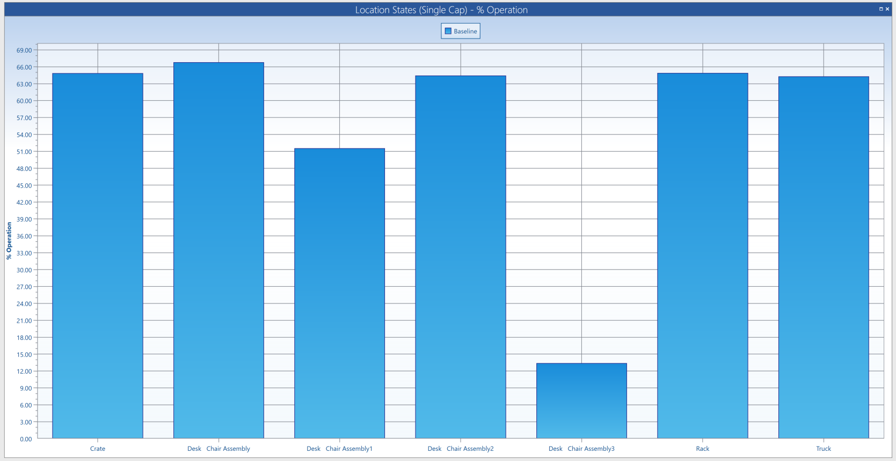

 
 

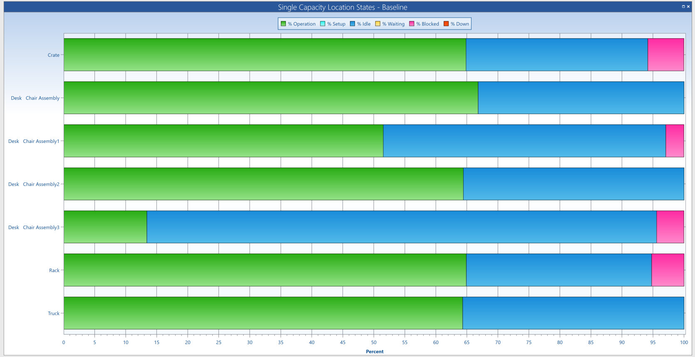

 
 

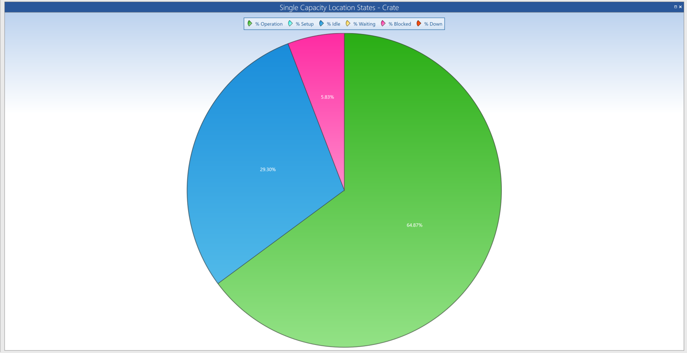

 
 

#### Costs
 

Cost tables and charts display cost information about your Locations, Entities and Resources, including total costs, operation costs, and usage costs. 
Cost tables display a collection of numbers to convey cost information. 
Cost charts use bar graphs to visually display cost information of a single category at a time. 
Use the **Output Viewer Filter** to change what information is displayed in a cost table or chart. 
 
 

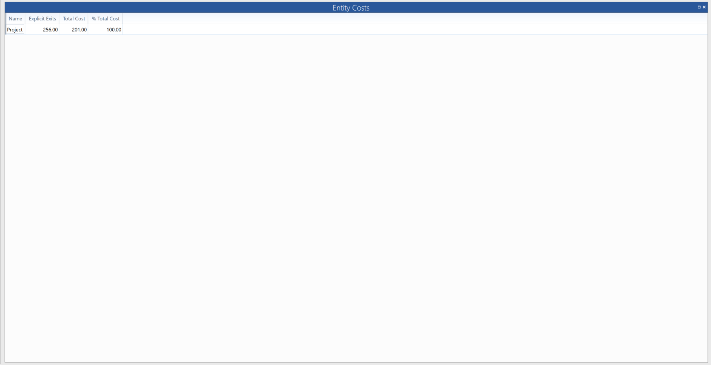

 
 

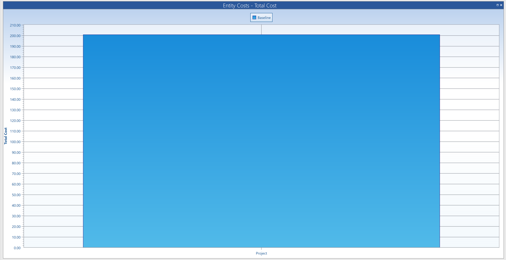

 
 

#### Utilization 
 

Utilization charts demonstrate in a percentage how much a particular Location or Resource was utilized during a simulation. 
More specifically, the Location Utilization chart shows the percentage of the overall scheduled time that the capacity of a location was utilized during the simulation. 
The Resource utilization chart shows the percentage of time each resource was used during the simulation. 
Use the **Output Viewer Filter** to change which items are included in a Location or Resource utilization chart.

 

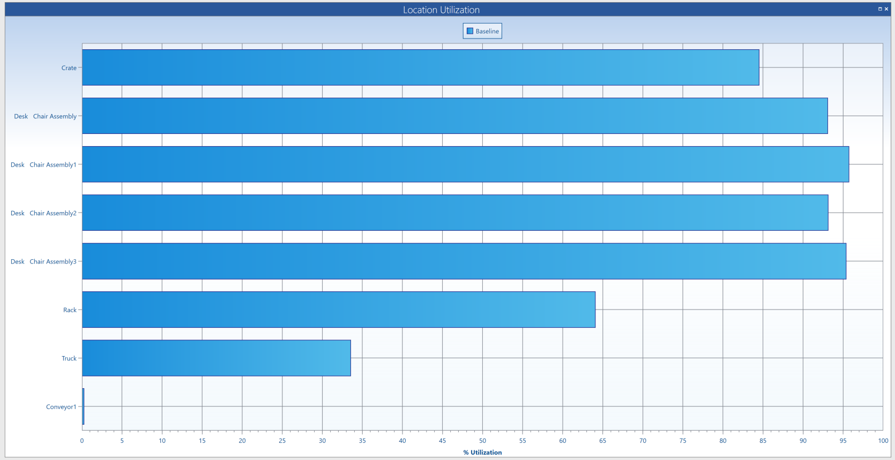

 
 

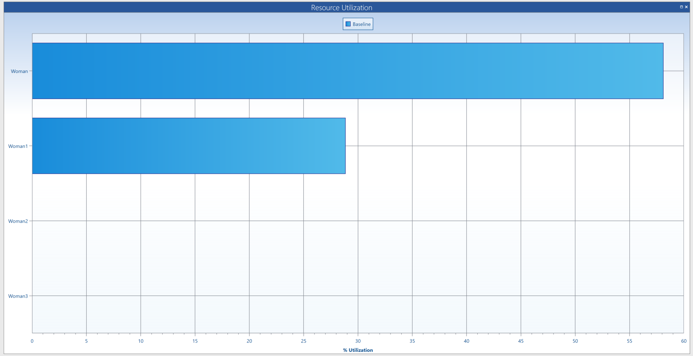

 
 

#### Time Series
 

The **Time Series** section includes charts that demonstrate time related information. 

The Time Plot chart uses a line graph to demonstrate different types of information over time such as contents, duration and Variable history. 

The Histogram chart displays the percentage of time that data fell within a particular range of values. 

 

 
 

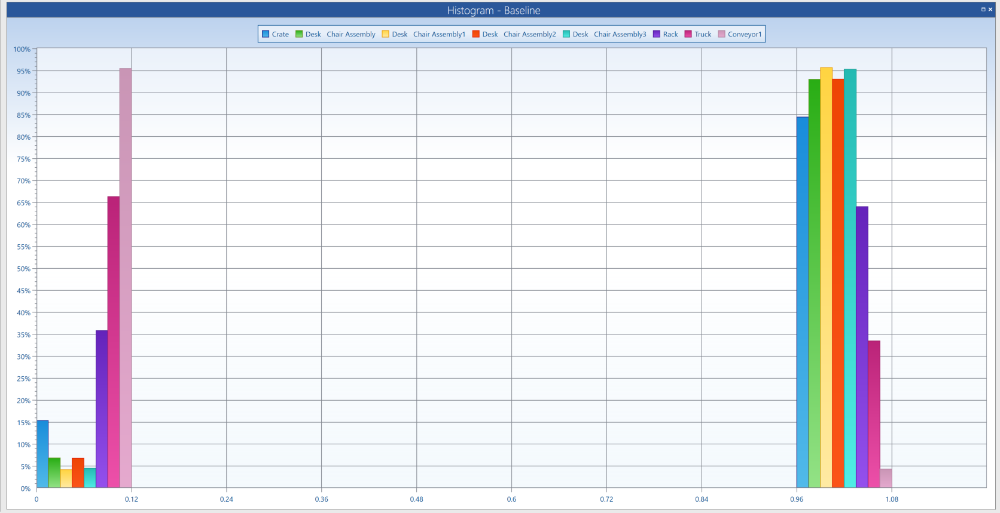

 
 

The **Time Series** section also includes charts to view previously discussed information on a time related basis, such as utilization and state.

 

 
 

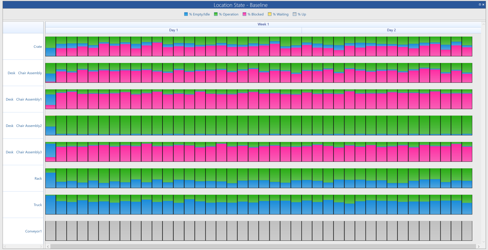

 
 

Once again, for more in depth information about how to navigate the **Output Viewer**, or how to interpret the information in tables or charts, click the **Help** button or use the following link to visit the [Output Viewer Help Guide](https://www.promodel.com/onlinehelp/outputviewer/51/). 

---

**Next**: [Learn to use additional helpful tools](/pmacad/help/topic?page=Help/Docs/ToolsAndLearn/Tools_and_Learn.md)

