

You are here: [Introduction](/pmacad/help/topic?page=Help/Docs/PMADHelpHome.md)/[Getting Started](/pmacad/help/topic?page=Help/Docs/GettingStarted/GettingStarted.md) > Tools and Learn

# **Tools and Learn**
***

 

The **Tools** section of the ProModel ribbon provides you with tools to easily modify your model and to expand your model by opening it in the ProModel application.

 

## Open in ProModel
 

The **Open in Promodel** icon allows you to take the model that you have created in AutoCAD® using the ProModel plugin and move it into the ProModel application. 
Opening your model in ProModel allows you to expand your project by using the additional capabilities that are available in the ProModel simulation software that aren’t available when using the ProModel AutoCAD® plugin.  

 

 
 

If you hover over the **Open in ProModel** icon you will see a description of the tool, as well as the command **PMOpenInProModel**. 
Typing this command into the command box is another way to open your model in the ProModel application.

In order to open your model in ProModel, you must have the ProModel application downloaded. 
For more information on how to download ProModel, see the [Installation and Licensing](https://www.promodel.com/onlinehelp/ProModel/108/C-01-WelcomeToProModel.htm#Topics/C-02-InstallationandLicensing.htm#C-02_3483315438_1022667%3FTocPath%3DInstallation%2520and%2520Licensing%7C_____0) section of the ProModel Help Guide.  

You must also have saved your current model in order to use the **Open in ProModel** feature.

After selecting the **Open in ProModel** icon, ProModel will open and build a simulation model using the marked Locations and the layout of your model as a background graphic.  

 

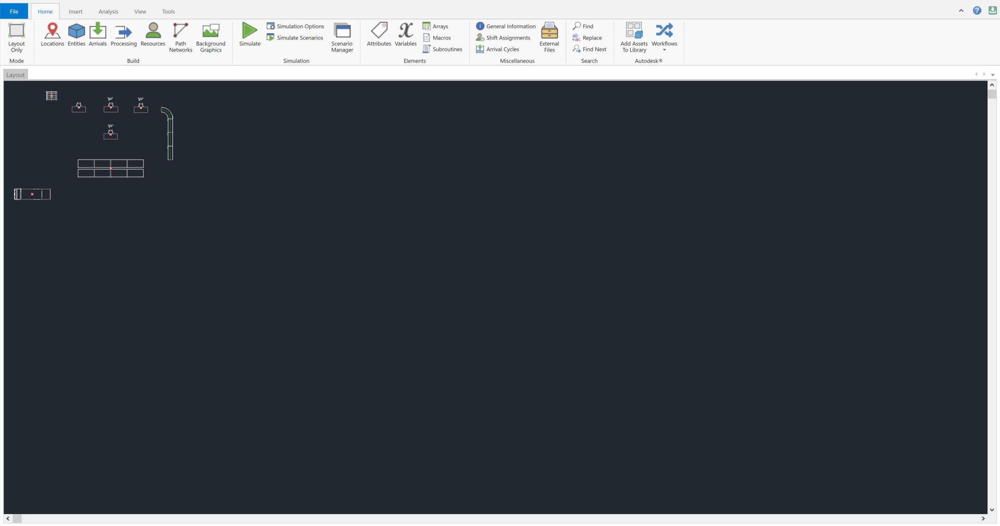

 
 

## Find
 

The **Find** icon allows you to open the find menu and search for items in your model using their name or the other information defined for the item in the **Simulation Properties** menu.

 

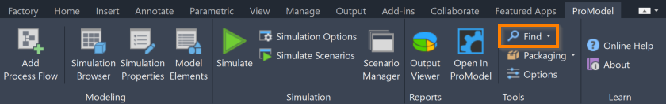

 
 

Type what you would like to search for into the **Find What** box.

 

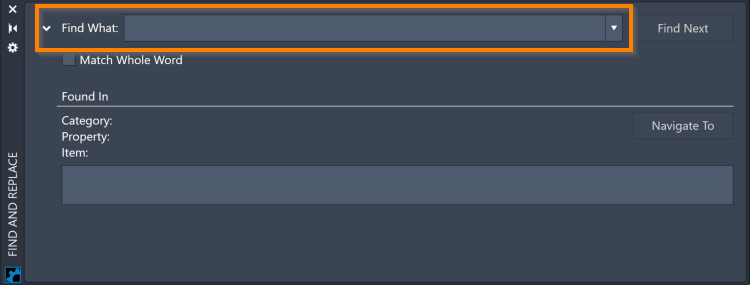

 
 

Press **Enter** on your keyboard to search your model and display the first match to your search. 
If there are multiple matches, use the **Find Next** button to navigate to the next match.

 

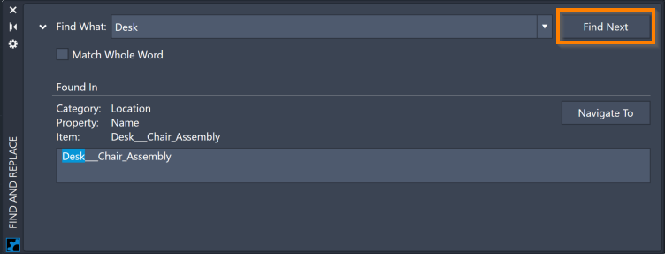

 
 

When viewing a matched item, the **Find** menu will display the category of the item, the property where the match was made, and the name of the item.   

Click the **Navigate To** button to highlight the matched item in the **Simulation Browser** and the item’s graphic on the layout. 
If applicable, the property field where the match was made will also be highlighted in the **Simulation Properties** menu.

 

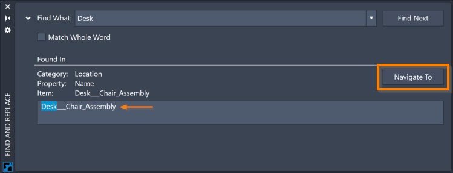

 
 

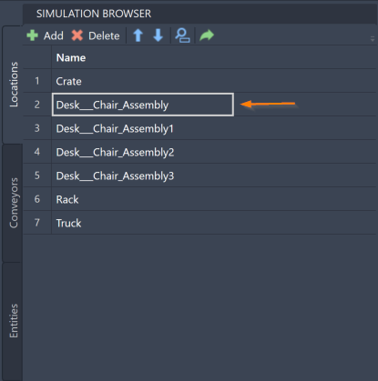

 
 

To ensure that matches are only made with items in your model if they contain the contents of your search as a full word, rather than as a portion of a word, click the **Match Whole Word** box to select it.

 

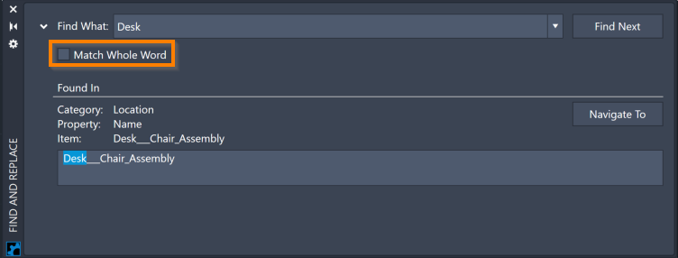

 
 

## Replace
 

Use the **Replace** icon to open a new menu where you can use the tools of the **Find** menu with additional **Replace** capabilities.

 

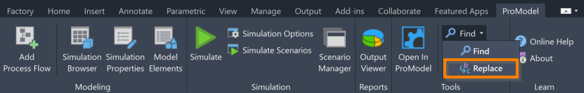

 
 

Use the **Find What** box to make a search like you would when using the **Find** menu. 
Once you have found your chosen items, use the **Replace With** box to determine what your searched string will change to for the matched items after the replacement.    

 

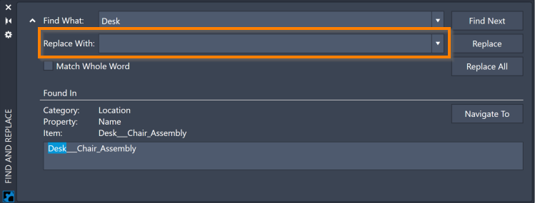

 
 

Select **Replace** to only make a replacement for the item currently being displayed. 

 

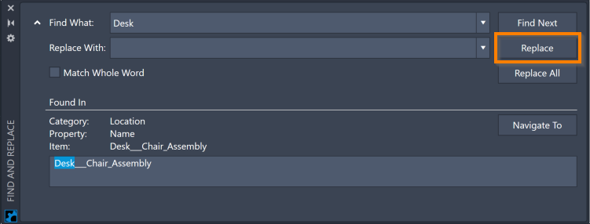

 
 

Select **Replace All** to make a replacement for all of the matched items. 

 

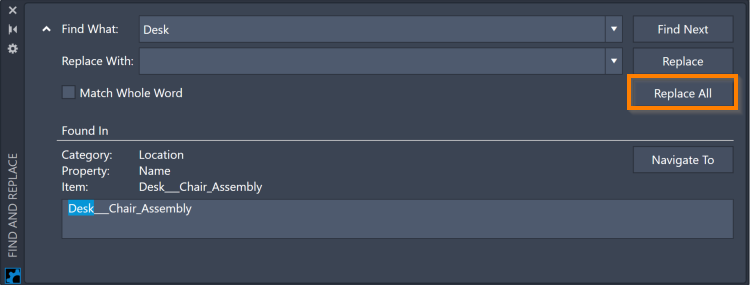

 
 

## Packaging 
 

The **Packaging** icon allows you to create or open packages. 
Packages can include everything being used in your project, such as Inventor files, so that you can easily share your project with others. 
Select the **Packaging** icon to choose whether you would like to create a package for your project or open a package that has been shared with you. 

 

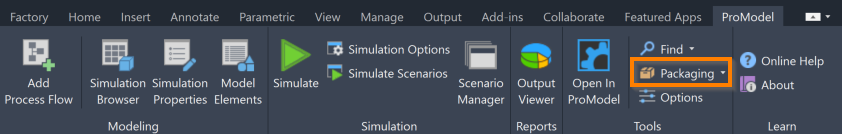

 
 

## Options
 

Use the **Options** icon to open the **Options** menu and make overall changes to your model. 

 

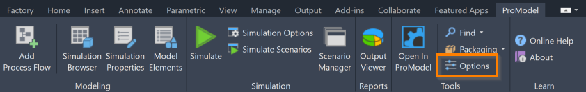

 
 

Use the **Process Time** box to set the default process time for Locations when they are added to a Flow. 
Note that there is a drop-down menu where you may select the unit of time that you would like to use. 
The contents of this field can be a set number or a distribution interval. 
For more information on distribution intervals, see the [Distribution Intervals](/pmacad/help/topic?page=Help/Docs/Modeling/Distribution_Intervals.md) section of the documentation. 

 

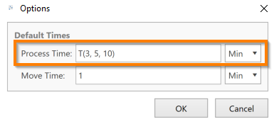

 
 

Use the **Move Time** box to set the default move time for Routes when they are created in a Flow. 
Note that there is a drop-down menu where you may select the unit of time that you would like to use. 
The contents of this field can be a set number or a distribution interval. 
For more information on distribution intervals, see the [Distribution Intervals](/pmacad/help/topic?page=Help/Docs/Modeling/Distribution_Intervals.md) section of the documentation.

 

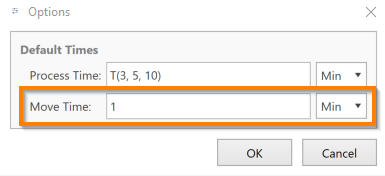

 
 

Select **OK** to save your changes to the **Options** menu. 
To close the **Options** menu without saving your changes, select **Cancel**.

 

## About
 

The **About** icon opens a menu that displays useful information about your ProModel AutoCAD® Edition software such as the version number, information about your licensing, and login information. 
You may also log out of your account using the **Logout** button. 

 

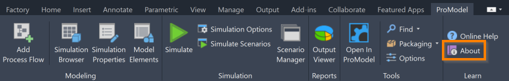

 
 

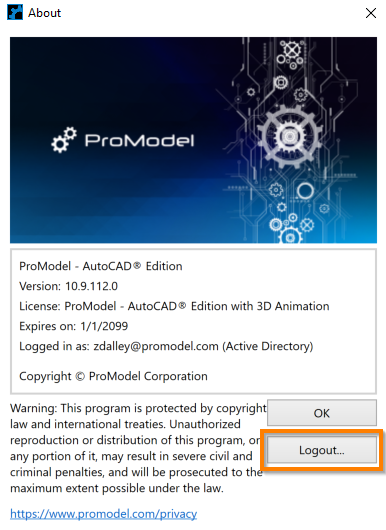

 
 

---

**Next**: [Learn about our 3D add-on, ProModel 3D Animator for Inventor](/pmacad/help/topic?page=Help/Docs/ProModel3DAnimator/ProModel_3D_Animator.md)

