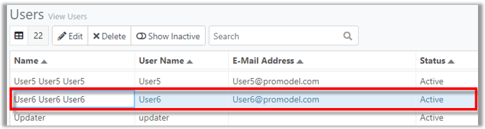
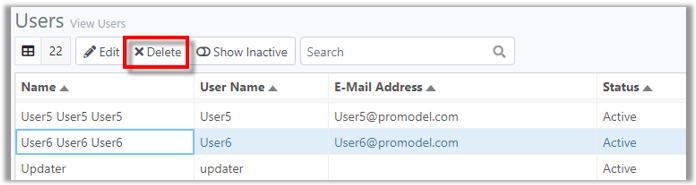
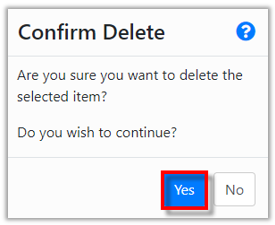
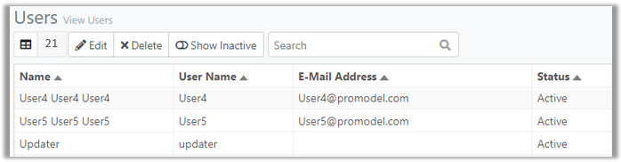



You are here: [Users](C:/_git/ProModelAutodeskEdition/PorfolioSimulator.Help/wwwroot/Help/Docs/Users/Users.md) > Delete User

----
### _Delete User_ 

**1.** Select a **User** to be deleted from the Users table. The selected User is indicated with a blue highlight.

**2.** Next, select the **Delete button** located in the Users toolbar.

**3.** A 'Confirm Delete' modal populates. Select **Yes** to continue and delete the user.

**4.** The deleted user no longer appears in the Users table.

##
Related Content:
- [Users (overview)](C:/_git/ProModelAutodeskEdition/PorfolioSimulator.Help/wwwroot/Help/Docs/Users/Users.md)
- [Edit User](C:/_git/ProModelAutodeskEdition/PorfolioSimulator.Help/wwwroot/Help/Docs/Users/EditUsers/EditUsers.md)
- [Search Users](C:/_git/ProModelAutodeskEdition/PorfolioSimulator.Help/wwwroot/Help/Docs/Users/SearchUsers/SearchUsers.md)

##
  &copy; 2020 ProModel Corporation  705 E Timpanogos Parkway  Orem, UT 84097  Support: 888-776-6633  www.promodel.com {style ="align: left"}

