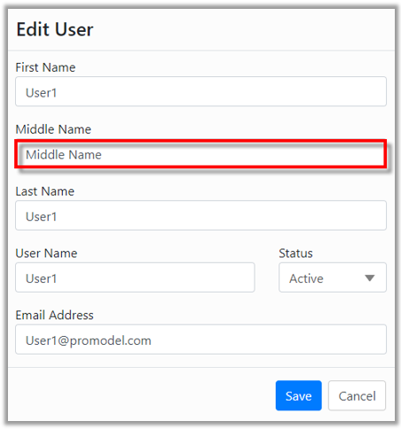

You are here: [Users](C:/_git/ProModelAutodeskEdition/PorfolioSimulator.Help/wwwroot/Help/Docs/Users/Users.md) > Edit Users

----
### _Edit User_ 

**1.** Select a **User** to be edited from the Users table. The selected User is indicated with a blue highlight.

**2.** Select the **Edit button** in the Users toolbar *(alternatively, double-click the User row to open the Edit User modal)*.

**3.** The Edit User modal populates as depicted below. Make the desired changes to the User account. In this example, the admin intends to add a **Middle Name**. 

**4.** Once all updates have been made, select **Save** in the lower-right corner of the modal.

**5.** The updated User table displays the changes made to the user.

##
Related Content:
- [Users (overview)](C:/_git/ProModelAutodeskEdition/PorfolioSimulator.Help/wwwroot/Help/Docs/Users/Users.md)
- [Delete User](C:/_git/ProModelAutodeskEdition/PorfolioSimulator.Help/wwwroot/Help/Docs/Users/DeleteUsers/DeleteUsers.md)
- [Search Users](C:/_git/ProModelAutodeskEdition/PorfolioSimulator.Help/wwwroot/Help/Docs/Users/SearchUsers/SearchUsers.md)

##
  &copy; 2020 ProModel Corporation  705 E Timpanogos Parkway  Orem, UT 84097  Support: 888-776-6633  www.promodel.com {style ="align: left"}

