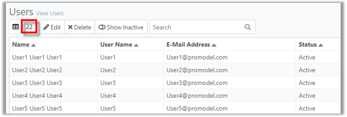
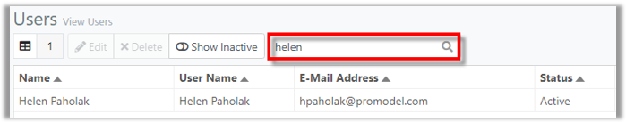
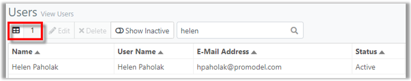
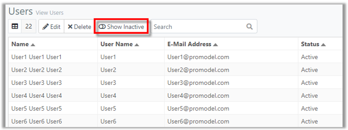
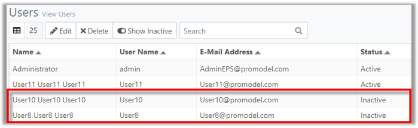
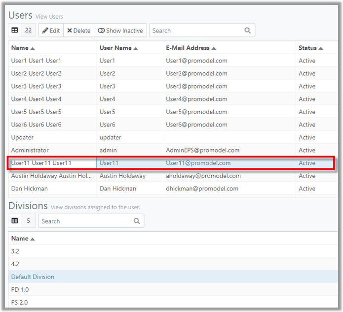
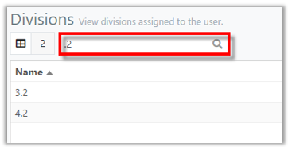
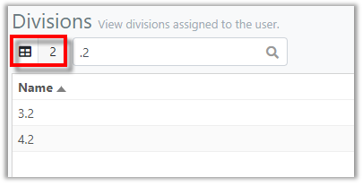



You are here: [Users](C:/_git/ProModelAutodeskEdition/PorfolioSimulator.Help/wwwroot/Help/Docs/Users/Users.md) > Search Users

----
### _Search Users_ 

**1.** The Users **Item Count** is displayed in the top left of the toolbar. 
This number represents the total number of Users in the application (22).

**2.** Users may search the Users table by Name, User Name or E-Mail Address. 
Simply key in the criteria in the **search bar** located in the Users toolbar. 
Search results populate as criteria is entered. 

**3.** Note that the **Item Count** updates to correspond with the number of Users displayed in the search results.

### _Show Inactive_
**1.** To view Inactive Users, select the **Show Inactive toggle** in the toolbar.

**2.** The table updates to include Inactive Users, as depicted in the image below.

### _Search Divisions_
**1.** Select a **User** to view the associated Divisions in the Divisions table. Some Users are assigned to multiple Divisions. In the example below, the user is assigned to five Divisions. 

**2.** The User may search the assigned Divisions using the **Search bar** located in the Divisions toolbar. Search results populate as criteria is entered.

**3.** Note that the **Item Count** updates to correspond with the number of Divisions displayed in the search results.

##
Related Content:
- [Users (overview)](C:/_git/ProModelAutodeskEdition/PorfolioSimulator.Help/wwwroot/Help/Docs/Users/Users.md)
- [Edit User](C:/_git/ProModelAutodeskEdition/PorfolioSimulator.Help/wwwroot/Help/Docs/Users/EditUsers/EditUsers.md)
- [Delete User](C:/_git/ProModelAutodeskEdition/PorfolioSimulator.Help/wwwroot/Help/Docs/Users/DeleteUsers/DeleteUsers.md)

##
  &copy; 2020 ProModel Corporation  705 E Timpanogos Parkway  Orem, UT 84097  Support: 888-776-6633  www.promodel.com {style ="align: left"}

