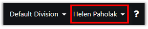
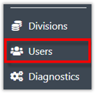
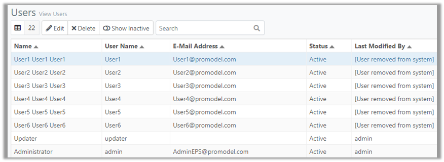
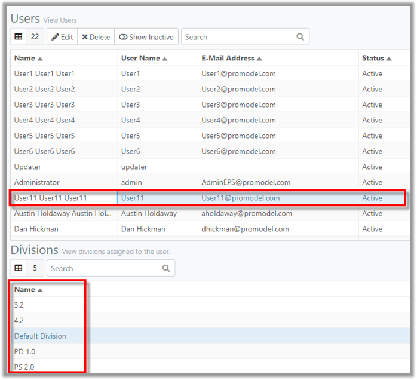



You are here: Users

----
## Users 

A user is an individual with a ProModel AutoCAD Edition (ProModel AutoCAD Edition) account. To log into the application, a user is required to authenticate with a user name and password for auditing and permission purposes.
Users may be assigned to one or more Divisions within the applicaton. For more information on Divisions, please refer to the [Divisions Chapter](C:/_git/ProModelAutodeskEdition/PorfolioSimulator.Help/wwwroot/Help/Docs/Divisions1/Divisions.md) of the ProModel AutoCAD Edition Help Guide.

When signed into ProModel AutoCAD Edition, the user name appears in the top-right corner of the screen, as depicted below.

### _Navigation_

**1.** After signing in, select the **Users link** in the navigation pane on the left-hand side of the screen. 

**2.** The user is directed to the Users page, as depicted below.  

**3.** Select a **User** to view the **Divisions** the User is assigned to. The associated Divisions appear in the Divisions table.

### _Terminology_
###### Users Table

**Name**: The first, middle (optional) and last name of the individual user.

**User Name**: The individual's user name, as entered by the admin upon user creation.

**E-Mail Address**: The individual user's associated e-mail address, as entered by the admin upon user creation.

**Status**: The individual user's status (active or inactive) as set by the administrator.

**Last Modified By**: The last admin user to make changes to the user account.

###### Divisions Table

**Name**: The name of the Division.

##
Related Content:
- [Edit User](C:/_git/ProModelAutodeskEdition/PorfolioSimulator.Help/wwwroot/Help/Docs/Users/EditUsers/EditUsers.md)
- [Delete User](C:/_git/ProModelAutodeskEdition/PorfolioSimulator.Help/wwwroot/Help/Docs/Users/DeleteUsers/DeleteUsers.md)
- [Search Users](C:/_git/ProModelAutodeskEdition/PorfolioSimulator.Help/wwwroot/Help/Docs/Users/SearchUsers/SearchUsers.md)

##
  &copy; 2020 ProModel Corporation  705 E Timpanogos Parkway  Orem, UT 84097  Support: 888-776-6633  www.promodel.com {style ="align: left"}

