

You are here: [Introduction](/help/topic?page=Help/Docs/PMADHelpHome.md)/[Getting Started](/help/topic?page=Help/Docs/GettingStarted/GettingStarted.md) > Simulation Tools

# **Simulation Tools**
***

 

Using the Simulation Tools that ProModel provides, you are able to simulate the models you create, edit the options for your simulations, and create multiple scenarios to simulate at once.

 

## Single Simulations
 

To simulate your active drawing that you have created in AutoCAD® and applied ProModel simulation properties to, select the green **Simulate** icon in the ProModel ribbon. 

 

 

If you hover over the **Simulate** icon, you can see a description of the tool, as well as the command **PMSimulate**. 
Typing this command into the command box is another way to begin simulating your active drawing. 

Once the simulation begins, you will see a variety of options that you may use as the simulation takes place. 

 

 

##### Play, Pause and Stop
 

The **Play**, **Pause** and **Stop** buttons allow you to pause and continue the simulation at any time, or end the simulation prematurely. 

 

 

Selecting the **Stop** button will cause the following window to appear: 

 

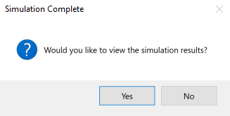

 

Select **Yes** to view the simulation results or select **No** to end the simulation without viewing the results. 
For more information on simulation results, see the [Simulation Results](/help/topic?page=Help/Docs/SimulationResults/Simulation_Results.md) section of the documentation.

 

##### Variables
 

The **Variables** icon allows you to view information about the Variables defined in your model. 

 

 

Selecting the **Variables** icon will open a new menu. 
Opening the **Variables** menu will pause the simulation until the menu is closed. 

 

 

The menu will display a list of the **Variables** in your model as well as their value at that time in the simulation. 
Select a **Variable** from the list and press the **Change** button to manually change the value of a Variable. 

The **Expression** box allows you to test expressions that involve the Variables defined in your model. 
Type an expression using the names of your Variables in the **Expression** box and click the **Result** button to view the results. 

 

 

Select the **Close** button to close the Variables menu. 

Select the **Print** button to print out information about your Variables. 

 

##### Locations
 

The **Locations** button allows you to view information about the Locations in your model. 

 

 

Selecting the **Locations** button will open a new menu. 
Opening the **Locations** menu will pause the simulation until the menu is closed.

 

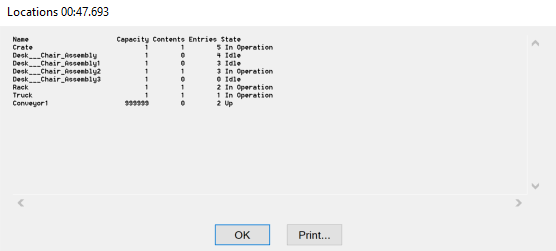

 

The **Locations** menu displays a list of the Locations in your model. 
The **Name** column lists the names of each of your Locations. 
The **Capacity** column displays the capacity of each Location. 
The **Contents** column displays how many Entities are in a particular Location at that time in the simulation. 
The **Entries** column displays how many times an Entity has entered a particular Location at that time in the simulation. 
The **State** column displays whether a particular Location is currently **In Operation** or **Idle** at that time in the simulation. 

Select the **OK** button to close the **Locations** menu.

Select the **Print** button to print out information about the Locations in your model.  

 

##### One Location
 

The **One Location** button allows you to view information about a particular Location as the simulation runs.

 

 

Selecting the **One Location** button will open a new menu displaying a list of the Locations in your model. 
Opening the **One Location** menu will pause the simulation until the menu is closed or until you select a Location from the menu.  

To close the **One Location** menu without making a selection, press the **Cancel** button. 

To select a Location to view, click your desired Location in the list and press the **OK** button. 
A new menu will now open and the simulation will resume.

 

  

The **Location Name** field displays the name of the Location you are currently viewing. 
The **Time** field displays the current time in the simulation. 
The **Type** field displays whether the Location is **Single-Capacity** or **Multi-Capacity**. 
The **Capacity** field displays the capacity of the Location you are viewing. 
The **Contents** field displays how many Entities are currently in the Location. 
The **Entries** field displays how many times an Entity has entered the Location. 
The **State** field displays whether the Location is currently **In Operation** or **Idle**. 
The **Current Contents** box displays a list of the Entities that are currently in the Location you are viewing. 
The contents of these fields will change as the simulation runs to reflect the occurrences in your simulation.

Select the **OK** button to close the **One Location** menu.  

 

##### View Controls 
 

The **View** collection of tools allow you to change how you view your simulation. 

The **Zoom to Fit** button will adjust the screen so that the view is as close to your graphics as possible while still keeping all of the graphics in your simulation in view on the screen. 

 

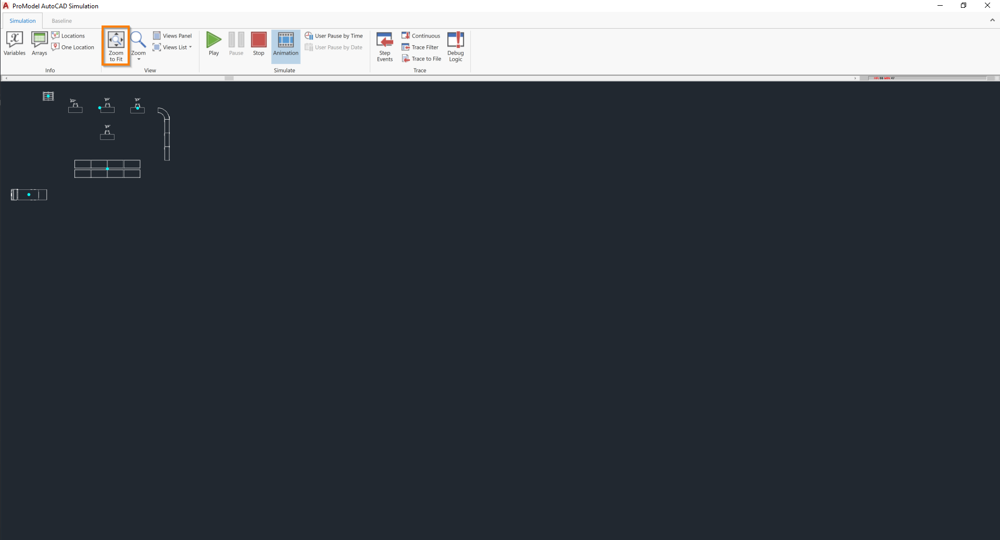

 

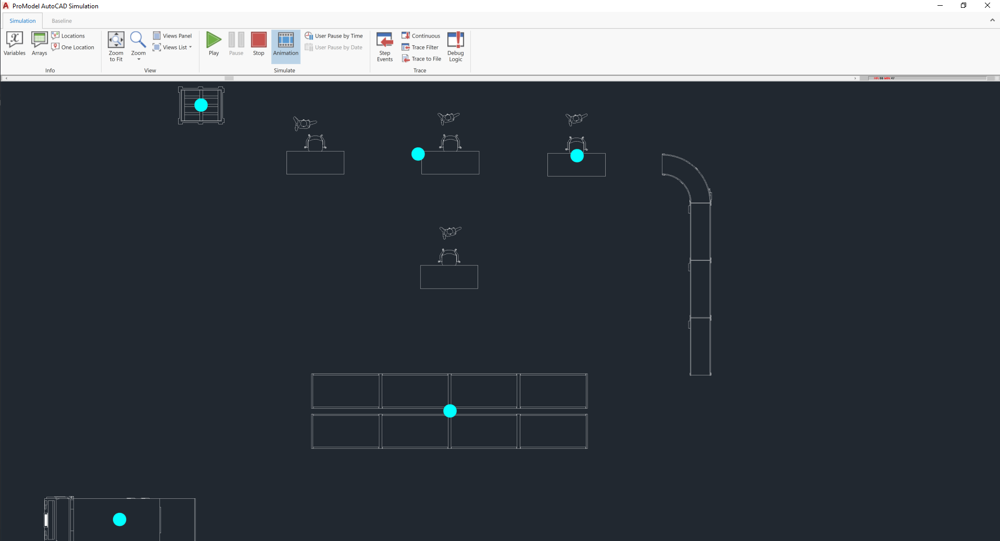

 

The **Zoom** button provides a list of zoom values from **25%** to **400%** that you may select to change how zoomed in to your simulation you are. 
You may also type a value into the **Custom Zoom** box to achieve a more precise zoom. 

 

 

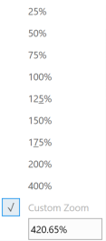

 

Use the **View Panel** and **Views List** buttons to see and interact with the views you have defined using the **Views** tab in the AutoCAD® ribbon.  

 

##### Animation 
 

Use the **Animation** button to turn off the animation feature for your simulation. 
By pressing the **Animation** button, you will end the animation and will immediately be prompted to view your simulation results. 
The **Animation** button differs from the **Stop** button in that your simulation will still be run in its entirety, you just won’t see the accompanying animation for it.

 

 
 

##### User Pause Buttons
 

The **User Pause by Time** and **User Pause by Date** buttons allow you to define a time or date in the simulation that will pause the simulation once it is reached. 

 

 

After selecting the **User Pause by Time** button, a new menu will open. 
The simulation will be paused until this menu is closed. 

 

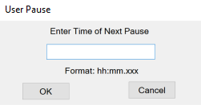

  

To define a time in the simulation when you would like the simulation to pause, enter a value in the **Enter Time of Next Pause** box. 
Note that the format is **hh.mm.xxx**.

To finish creating your pause time, select **OK**.

To close the **User Pause by Time** menu without creating a pause time, select **Cancel**.

The **User Pause by Date** button functions similarly. 

 

##### Trace
 

The **Trace** collection of tools allow you to trace your simulation more closely and view your Logic statements as your simulation progresses. 

The **Step Events** icon opens a window that allows you to view simulation events. 

 

 

 

The **Step Events** window provides a description of each event in the simulation as it occurs. 
To progress to the next event in the simulation, left-click your mouse. 
To scroll through several events at once, right-click and hold your mouse. 
As you click to progress through events in the simulation, the graphics in the simulation animation will reflect the progression of the simulation. 

The **Continuous** button displays descriptions of simulation events in real time as the simulation runs. 
Right-click and hold your mouse to pause the simulation. 

The **Trace Filter** button opens a new menu that allows you to filter which items appear in a trace while using the **Step Events** or **Continuous** options. 

 

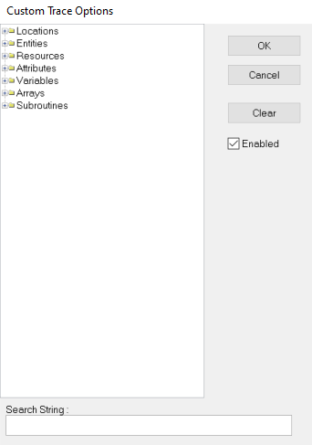

 

The **Trace Filter** menu is composed of seven folders: Locations, Entities, Resources, Attributes, Variables, Arrays and Subroutines. 
Double click a folder to see a list of items you have created that correspond to the chosen folder.

 

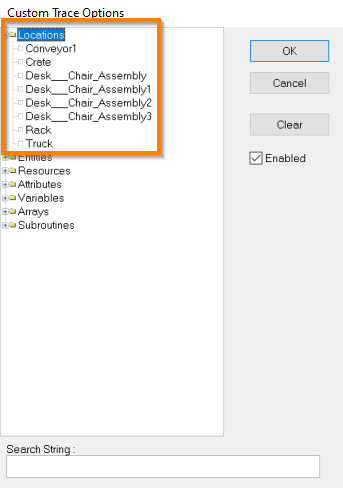

 

Click on the box to the left of an item to select it and include it in the trace. 
Click on the box again to deselect the item.  

To confirm your selections, select **OK**.

To close the **Trace Filter** menu without saving your changes, select **Cancel**.

To deselect all items from your **Trace Filter**, select **Clear**.

To toggle whether or not your **Trace Filter** will be used, click the **Enable** box. 
If the box is checked, then your traces will only include the selected items. 
Otherwise, all model items will be included in traces.    

The **Trace to File** button allows you to copy trace information into a file while using the **Step Events** or **Continuous** option that you may view after the simulation. 
Select the **Trace to File** button to toggle this option. 

The **Debug Logic** icon allows you to open the model debugger and step through the Logic statements in your model one at a time.  

 

 

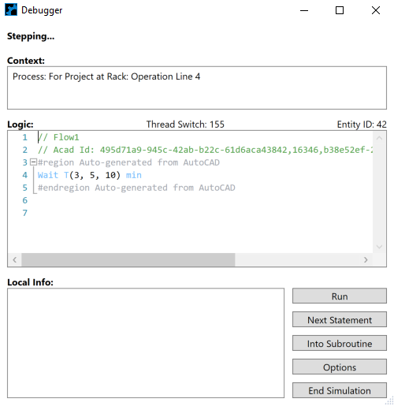

 

Use the **Run** button to continue the simulation.  

Use the **Next Statement** button to step to the next Logic statement in your model.

Use the **Options** button to view further options for debugging your Logic. 

Use the **End Simulation** button to end the simulation.

   

##### Simulation Speed  
 

To control the speed of your simulation, see the **white bar** with a **gray rectangle** underneath the ribbon tools. 

 

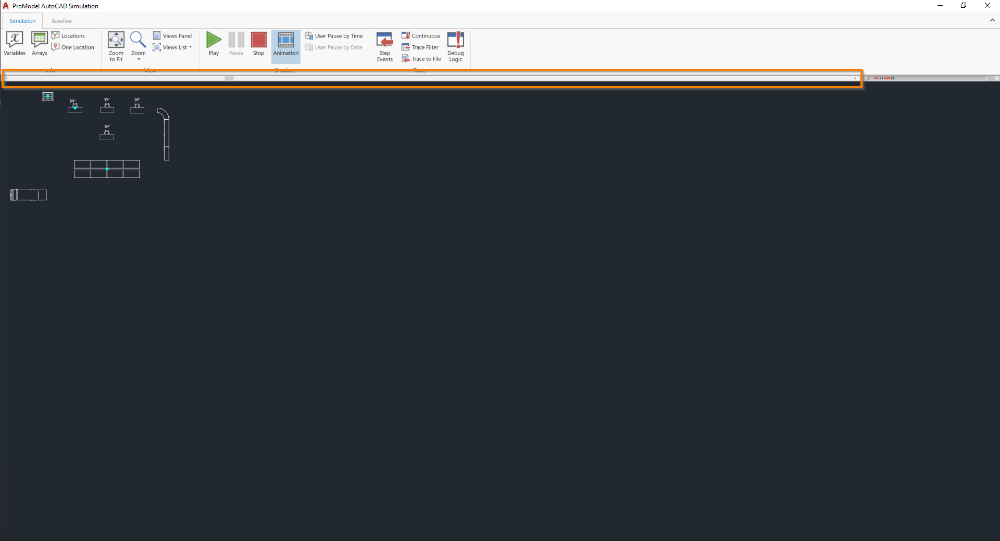

 

Click and drag the **gray rectangle** to control the speed of your simulation. 
You may also click on the **white bar** to move the **gray rectangle** in the direction of your mouse. 
Moving the **rectangle** left will slow the simulation down and moving the **rectangle** right will speed the simulation up. 

The amount of time that has passed in your simulation is displayed to the right of the **speed bar**.

 

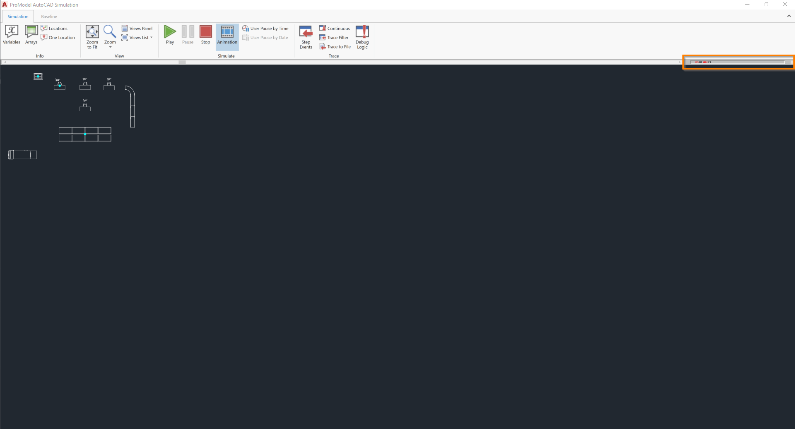

 

## Simulation Options
 

The **Simulation Options** button allows you to open the **Simulation Options** window and fine tune the details of your simulation. 

If you hover over the **Simulation Options** button, you will see a description of the tool and the command **PMSimulationOptions**. 
Typing this command into the command box is another way to open the **Simulation Options** menu. 

There are two tabs available in the **Simulation Options** window: **General** and **Animation**.

 

##### General
 

Navigate to the **General** tab to edit general information about your simulation.  

Use the **Run Length Type** box to choose whether you would like your simulation to be **Time Only**, **Weekly Time** or **Calendar Date**. 
Which option you choose should depend on how long you want your simulation to run. 
Select the **Run Length Type** box to see a drop-down menu of these three options. 

Use the **Warmup Period** box to toggle whether or not there should be a warmup period in your simulation. 
A warmup period will be a length of time at the beginning of your simulation that will pass before the rest of the simulation begins. 

How you define the length of your warmup period once you have checked the **Warmup Period** box will depend on whether your simulation is set to **Time Only**, **Weekly Time** or **Calendar Date**.

For a **Time Only** warmup length, enter a value in the **Warmup Length** box to represent how long the warmup period should be. 
Note that there is a drop-down menu where you may choose the unit of time that you would like to use. 
The default selection is **0 Hrs**. 

For a **Weekly Time** warmup length, the **Week** box will be set to **1** and you will be unable to change its value. 
However, you may select the day of the week the warmup will occur and the time. 
Select the **Day** box to see a drop-down menu where you may select which day of the week the warmup period should take place on. 
The default selection is **Monday**. 
Use the **Time** box to determine at what time on your chosen day the warmup period should occur. 
Click on the icon in the **Time** box to see a table of possible times, which range from **12:00 AM** to **11:30 PM** at half hour intervals. 
You may also type in a more precise time manually. 
The default time is **12:00 AM**.

For a **Calendar Date** warmup length, change the value in the **Warmup Begin** box to reflect both the date and time when the warmup should occur. 
Note that the format is **mm/dd/yyyy 00:00 AM/PM**. 
You may also click on the icon in the **Warmup Begin** box to see a calendar which you can use to select your desired date and time. 
The default setting is your current date while using the program at **12:00 AM**.

How you define when your simulation begins or ends also depends on whether your simulation is defined as a **Time Only**, **Weekly Time** or **Calendar Date** type. 

For **Time Only** simulations, change the value in the **Run Length** box to determine how long your simulation will run. 
Note that there is a drop-down menu where you may select the unit of time that you would like to use. 
The default run length for a **Time Only** simulation is **40 hrs**.   

For **Weekly Time** simulations, use the **Simulation Begin** and **Simulation End** fields to define when your simulation will begin and end. 
The value in the **Week** boxes define at which week the simulation will begin and end. 
The default setting for a **Weekly Time** simulation is that it will begin during the **first** week and end during the **fifth** week. 
The **Day** boxes determine on what day of a given week the simulation will begin and end. 
Click on a **Day** box to see a drop-down menu where you may select a day of the week. 
The default selection for a **Weekly Time** simulation is that it will begin on a **Monday** and end on a **Friday**. 
The **Time** boxes determine at what time on your chosen day the simulation will begin and end. 
Click on the icon in a **Time** box to see a table of possible times, which range from **12:00 AM** to **11:30 PM** at half hour intervals. 
You may also type in a more precise time manually. 
The default setting for a **Weekly Time** simulation is that it will begin at **8:00 AM** and end at **5:00 PM**.

For **Calendar Date** simulations, use the **Simulation Begin** and **Simulation End** boxes to define when your simulation will begin and end. 
Change the values in the **Simulation Begin** and **Simulation End** boxes to reflect both the date and time when the simulation should begin and end. 
Note that the format is **mm/dd/yyyy 00:00 AM/PM**. 
You may also click on the icon in the **Simulation Begin** and **Simulation End** boxes to see a calendar which you can use to select your desired date and time. 
The default setting for a **Calendar Date** simulation is that it will begin on the current date at **8:00 AM** and end on the same day of the following month at **5:00 PM**.

For **Calendar Date** simulations, the **Adjust for Daylight Savings Time** box allows you to set your simulation to adjust the start and end times when a Daylight Savings date occurs. 

The **General** tab of the **Simulation Options** menu also allows you to add replications to your simulation. 
Use replications if your model includes variance and you want a larger sample size of simulations that you can easily view and compare. 
To add replications to your simulation, change the value in the **Replications** box to reflect your desired number of replications. 
The default setting is **1**, meaning that only one version of your simulation will run. 
ProModel will accept any integer between **1** and **999** in this field. 

You may also change the value in the **Clock Precision** box to determine how precise the value that the **Clock** function returns is. 
Note that there is a drop-down menu where you may select which unit of time you would generally like to use in your model. 
This unit of time will be used whenever a unit of time is not specified in a Logic statement. 

 

##### Animation
 

Navigate to the **Animation** tab to edit animation information about your simulation. 

Use the **Enable Animation** box to choose whether or not an animation will play during your simulation. 
The **Enable Animation** box is automatically checked. 
If the box is unchecked, when you simulate your model the simulation will complete as quickly as possible without waiting for an animation to play out, and you will immediately be asked if you would like to view the simulation results. 
Click the box to toggle the **Enable Animation** option.

To change the starting animation speed of your simulation, use the slider in the **Initial Animation Speed** field. 
This setting will determine where the **gray rectangle** in the **speed bar** begins when you start a simulation. 
Click and drag the box on the slider to change the setting, or click on the slider itself to move the box in the direction of your mouse. 
The default **Initial Speed** setting is **25**.

The **Simulation Start Options** are used to change what occurs as you begin a simulation. 
Click on the **Pause Simulation** box to select it and set your simulations to pause right as they are started until you press play. 
Click on the **Show Trace** box to select it and set your simulations to display trace information right as they begin. 
Click on either box again to deselect these options. 
Both options are unselected by default.    

Press **OK** to save your changes in the **Simulation Options** menu. 

To close the **Simulation Options** menu without saving your changes, press **Cancel**. 

 

## Scenario Manager
 

The **Scenario Manager** allows you to create scenarios for your model. 
Scenarios are additional instances of the simulation that you can make certain changes to without creating a separate model to test different settings. 

If you hover over the **Scenario Manager** icon, you will see a description of the tool and the code **PMScenarioManager**. 
Typing this command into the command box is another way to open the **Scenario Manager** menu. 

When you first open the **Scenario Manager**, you will see parameters listed for your baseline simulation, which is the simulation that uses the information from the model you have created. 
The initial parameters listed are the **Simulate Scenario?** parameter and the **Last Run Date** parameter. 
The **Simulate Scenario?** parameter allows you to check or uncheck a box to reflect whether or not a scenario should run when you simulate your scenarios. 
Click this box to deselect your baseline simulation. 
The **Last Run Date** parameter displays the date when you last simulated your baseline simulation.

To display additional parameters, use the **Add Parameters** button, which will then display a list of potential parameters based on the created items in your model. 

Select an item to display it as a parameter. 
When you select an item, it will disappear from the **Add Parameters** list, since it has already been added. 
To change the name of a parameter, double click on its name to edit it.
You will not be able to edit the values for these parameters for your baseline simulation, since the values for the baseline simulation are determined by the settings in your model. 
However, these values will be editable for your created scenarios. 

To add a new scenario, use the **Add Scenario** button.

Once you select **Add Scenario**, a window will open that prompts you for a scenario name. 

Enter your desired name for this scenario and select **OK** or press **Enter** on your keyboard to confirm. 
To instead exit out of the adding process, select **Cancel**.

Once you have chosen a name for your scenario and confirmed, it will appear next to your baseline simulation in the **Scenario Manager** menu.  

You will now be able to edit the values of any of your added parameters for your new scenario, allowing you to quickly simulate different versions of your model in a row. 
Double click any of the boxes under your new scenario to type in a new value. 
You may also use the **Simulate Scenario?** box to determine whether or not your new scenario will be included when simulating scenarios. 

By default, a created scenario will display the same values for their parameters as your baseline simulation until they are changed. 
If you would rather these parameters display as blank, click the **Show Baseline Values** box to deselect it. 

To change the position of a parameter in the **Scenario Manager** menu, select a parameter and use the blue “**up**” and “**down**” arrows to change the order of the parameter. 

To access more options for a scenario, right-click on the scenario’s name. 

Select **Edit Scenario Name** to change the name of a scenario. 

Select **Duplicate Scenario** to create a new scenario with the name “Copy of **Scenario Name**” with the same parameter values as the scenario you duplicated. 

Select **Delete Scenario** to remove a scenario from the **Scenario Manager**.

Select **Reset Parameter Names** to change the names of the parameters that you have edited back to their default names.

Select **Delete Parameters** to remove all added parameters from the **Scenario Manager**.

Select **Reset Values to Baseline** to change a scenario's parameter values back to the values of your baseline simulation.  

To save the changes made in the Scenario Manager, select **OK**.

To close the **Scenario Manager** menu without saving your changes, select **Cancel**.

To save the changes made in the **Scenario Manager** and begin simulating your created scenarios, select **Run Scenarios**. 
You may also select the **Simulate Scenarios** button in the ProModel ribbon or type **PMSimulateScenarios** into the command box to start simulating your scenarios at any time.   

Your scenarios will then begin simulating, starting with your baseline simulation and continuing in the order that they were created. 
To see what scenario is currently simulating, see the text at the top of the screen text to the **Simulation** tab.

---

**Next**: [Learn how to interpret Simulation Results](/help/topic?page=Help/Docs/SimulationResults/Simulation_Results.md)  

